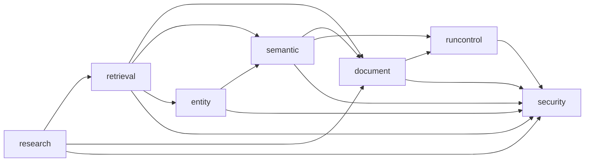

# 溯知（OntoTrace）开发落地指南

> 状态：开工基线 0.2（直接从 B0 实施）  
> 日期：2026-09-03  
> 上位方案：[blueprint.md](./blueprint.md) 1.13

## 1. 文档用途

本文回答“如何把方案落实为代码”。产品定义、领域语义、质量标准和能力边界以 `blueprint.md` 为准。两份文档出现冲突时，先修订上位方案，再改实现；不要在代码中形成另一套隐含设计。

仓库当前只有方案和样例材料，没有应用代码、构建文件或数据库迁移。本轮按[《整体规划》阶段 A](./blueprint.md#阶段-aedu-可行性实验)已经完成且通过处理，直接从 B0 开始代码落地，按 B 至 E 的完整功能路线推进。这是本轮实施前提，不代表本文新增了实验结果。

阶段 A 的标注一致性实验、表示方案对照、模型消融、产品价值与经济性验证均不再排期，也不要求补交阶段 A 报告后才能开工。原计划在 A 阶段编写的输出契约、上下文组装、来源定位、确定性校验和模型复核代码并入 B0。现有样本和模型配置可直接复用；缺少归档材料不阻塞应用初始化。

B 及后续阶段仍需完成各自的功能、权限、数据完整性、质量和性能验收。阶段 A 的通过假设不替代代码正确性检查，也不预先确认 D-scale 的规模验证结论。

## 2. 必须继承的设计基线

实现前先固定以下约束。它们已经在整体规划中完成设计，本文不另起一套方案。

### 2.1 架构基线

> “从一个可部署应用开始；使用关系数据库保存权威数据；使用 S3 对象存储保存原始资产和大型解析产物；图关系由普通表和查询实现；向量检索优先使用数据库扩展；异步任务使用数据库任务表和工作进程；根据实测瓶颈拆分服务，而不是预先分布式化。”  
> ——[《整体规划》17.1 架构原则](./blueprint.md#171-架构原则)

因此首版采用单体应用、单个 Maven 模块、一个 Vue 单页应用、一个 PostgreSQL 数据库和一个 S3 桶。API 进程与任务执行器可以使用同一镜像，通过配置决定是否启用任务领取。首版不拆微服务，也不引入 Kafka、Quartz、工作流引擎、专用向量数据库或图数据库。

### 2.2 领域边界

代码包沿用[《整体规划》17.4 逻辑模块](./blueprint.md#174-逻辑模块)：

- 文档管理 `document`
- 语义重建 `semantic`
- 实体关联 `entity`
- 检索 `retrieval`
- 研究生成 `research`
- 运行控制 `runcontrol`

权限认证属于平台基础能力，放在 `security` 包。它不发展成通用权限规则引擎。各业务模块仍负责在自己的查询中应用资源权限。

> “这些是代码组织边界，不要求分别部署。”  
> ——[《整体规划》17.4 逻辑模块](./blueprint.md#174-逻辑模块)

### 2.3 权威数据与派生数据

权威数据包括文档、文档版本、文本单元、EDU、来源引用、EDU 参数、文档级实体链接、共享 Entity、处理运行和研究成果。全文索引、向量、实体关联图投影、列表缓存都属于可重建数据。

> “EDU 是语义权威记录；实体是跨 EDU 的身份索引；图边来自 EDU 参数和文档级实体链接；原文是最终复核依据。”  
> ——[《整体规划》10.1 图的定位](./blueprint.md#101-图的定位)

代码不能把派生索引写回权威记录，也不能让图投影拥有独立修改入口。

## 3. 技术选型

### 3.1 版本基线

下表继承[《整体规划》17.2 技术栈选型](./blueprint.md#172-技术栈选型)，并补充开工所需的具体版本和使用方式。所有版本必须写入 `pom.xml`、`package.json`、Maven Wrapper、`pnpm-lock.yaml` 和 `.node-version`，构建过程不得使用浮动的 `latest`。

| 范围 | 选择 | 落地约束 |
| --- | --- | --- |
| Java | Java 21 | 后端统一运行时；优先使用 record、sealed type 和标准库；样板代码使用 Lombok |
| 后端 | Spring Boot 4.1.1 | 使用 Spring MVC，不引入 WebFlux；流式输出只使用 MVC 支持的 SSE |
| 模型集成 | Spring AI 2.0.1 | 使用 BOM 管理版本；首个可用模型必须支持原生 JSON Schema |
| 构建 | Maven Wrapper | 单 Maven 模块；开发和 CI 都调用 `./mvnw` |
| 数据访问 | Spring Data JDBC | 普通 CRUD 用 Repository；自定义 SQL 写在 Repository `@Query`；不要另写 `JdbcClient` 查询类 |
| 数据库 | PostgreSQL 16+、pgvector、`pg_trgm` | 同库保存业务数据和向量；中文全文方案在阶段 B 基准后确定 |
| 迁移 | Flyway | 迁移只前进，不在共享环境修改已执行脚本 |
| 对象存储 | S3 兼容存储、AWS SDK for Java 2.x | 生产可用 AWS S3；本地使用 MinIO；浏览器预签名直传 |
| 文档解析 | `DocumentParser` + MinerU Web API | TXT/Markdown 走内置同步导入器；其他格式先接 MinerU |
| 认证 | Spring Security、账号密码、服务端 Session | SPA 与 API 同源部署；使用 HttpOnly/Secure/SameSite Cookie 和 CSRF 防护，不自建 JWT 或 OIDC |
| OpenAPI | springdoc-openapi 3.1.0 | 后端生成 OpenAPI 3；前端不手写重复 DTO |
| Node.js | Node.js 24 LTS | 写入 `.node-version`；只用于前端构建和工具链 |
| 前端 | Vue 3、TypeScript、Vite | Composition API、`<script setup lang="ts">`、TypeScript strict |
| UI | shadcn-vue、Tailwind CSS 4 | 只安装实际使用的组件；设计令牌统一放在 CSS 变量中 |
| AI UI | AI Elements Vue | 阶段 D 按需加入消息、引用和流式状态组件；不改变后端 REST/SSE 契约 |
| 路由 | Vue Router | 路由参数承载项目、文档版本和当前范围 |
| 服务端状态 | TanStack Vue Query | 列表、详情、缓存失效和任务轮询均由 Query 管理 |
| 客户端状态 | Pinia | 只保存跨页面的阅读偏好和工作台会话状态；服务端数据不复制进 Store |
| 表单 | VeeValidate + Zod | 用于上传配置、EDU 编辑等复杂表单；简单筛选直接使用 Vue 状态 |
| API 客户端 | openapi-typescript + openapi-fetch | 生成类型并复用浏览器 `fetch`；不再引入 Axios |
| 后端测试 | JUnit 5、Spring Security Test、Testcontainers | 重点覆盖 PostgreSQL、权限、任务租约、S3 兼容和模型契约 |
| 前端测试 | Vitest、Vue Test Utils、Playwright | 组件只测重要交互；每阶段保留一条主链路浏览器测试 |
| 部署 | OCI 镜像、Docker Compose | 首期不引入 Kubernetes |

版本选择已核对官方资料：Spring Boot 4.1 支持 Java 21，Spring AI 2.0.x 支持 Spring Boot 4.0/4.1，springdoc-openapi 3.x 支持 Spring Boot 4，Node.js 24 当前处于 LTS。参考：[Spring Boot 系统要求](https://docs.spring.io/spring-boot/system-requirements.html)、[Spring AI Getting Started](https://docs.spring.io/spring-ai/reference/getting-started.html)、[springdoc-openapi](https://springdoc.org/)、[Node.js Releases](https://nodejs.org/en/about/previous-releases)。

### 3.2 后端直接依赖

首个 `pom.xml` 直接按 B0 产品应用初始化，加入 Web MVC、Validation、JDBC、Flyway、Security、Actuator、OpenAPI 和测试依赖。B0 接入上传与 EDU 抽取时，再加入 S3、Spring AI 和所选模型提供方 starter，不再单独建立阶段 A 实验工程。

后端最终需要的直接依赖如下：

- `spring-boot-starter-webmvc`
- `spring-boot-starter-validation`
- `spring-boot-starter-security`
- `spring-boot-starter-data-jdbc`
- `spring-boot-starter-actuator`
- `flyway-core` 及 PostgreSQL 数据库支持
- PostgreSQL JDBC Driver
- `spring-ai-bom` 与一个确定的模型提供方 starter （openai capable）
- AWS SDK v2 的 S3 模块
- `springdoc-openapi-starter-webmvc-ui`
- 测试范围的 `spring-boot-starter-test`、`spring-security-test` 和 Testcontainers
- Lombok

暂不加入 JPA、MyBatis-Plus、MapStruct、Resilience4j、消息中间件客户端和缓存框架。模型、MinerU 与 S3 的超时和有限重试先使用各自客户端能力；出现统一熔断需求后再评估 Resilience4j。

### 3.3 前端直接依赖

B0 开始建设前端，按页面实际需要加入以下基础依赖：

- `vue`、`vue-router`
- `@tanstack/vue-query`
- `pinia`
- `vee-validate`、`zod`
- `openapi-fetch`
- `tailwindcss` 与 shadcn-vue 实际生成组件所需依赖，尽量使用shadcn-vue原生组件
- 开发依赖中的 Vite、TypeScript、`vue-tsc`、Vitest、Vue Test Utils、Playwright、`openapi-typescript`

AI Elements Vue 到阶段 D 再按组件安装。它会把组件源码写进仓库，只安装 `conversation`、`message`、`sources` 和输入框等已使用组件，不一次导入全部组件。若生成的组件源码确实引用 `ai` 包，再把它作为前端依赖加入；不要为了 UI 组件改变平台的 Spring AI、REST 和 SSE 后端协议。

## 4. 仓库与文件结构

### 4.1 根目录

最终目录如下。方括号表示首次出现的阶段；不要预先创建空目录或占位类。

```text
project-suzhi/
├── blueprint.md
├── dev-landing.md
├── README.md                         # [B0] 本地命令、配置入口、阶段状态
├── .editorconfig                     # [B0]
├── .gitignore
├── .node-version                     # [B0]
├── .env.example                      # [B0] 只列变量名和非敏感示例
├── compose.yaml                      # [B0] PostgreSQL + MinIO
├── backend/                          # [B0]
│   ├── mvnw
│   ├── mvnw.cmd
│   ├── .mvn/wrapper/
│   ├── pom.xml
│   └── src/
├── frontend/                         # [B0]
│   ├── package.json
│   ├── pnpm-lock.yaml
│   ├── vite.config.ts
│   ├── tsconfig.json
│   ├── components.json
│   └── src/
├── evaluation/                       # [B0 起] 回归样本、输出契约与后续阶段验收记录
│   ├── README.md
│   ├── gold/
│   ├── questions/
│   ├── schemas/
│   └── reports/
└── doc/                              # 已有材料与后续说明
```

不建立 Maven 多模块、前端 monorepo、`shared-kernel` 或单独的“公共模型”工程。OpenAPI 是前后端共享契约，生成的 TypeScript 文件放在前端仓库内。

### 4.2 后端包结构

Java 根包暂定为 `com.ontotrace`。如果团队已有受控域名，应在第一个 Java 提交前一次性改成对应倒序域名；进入业务开发后不再改包根名。

```text
backend/src/main/java/com/ontotrace/
├── OntoTraceApplication.java
├── security/                                      # [B]
│   ├── SecurityConfig.java
│   └── CurrentUser.java
├── document/                                      # [B]
│   ├── DocumentController.java
│   ├── DocumentService.java
│   ├── Document.java
│   ├── DocumentVersion.java
│   ├── TextUnit.java
│   ├── DocumentRepository.java
│   ├── asset/
│   │   ├── UploadController.java
│   │   ├── UploadService.java
│   │   └── S3AssetStore.java
│   └── parser/
│       ├── DocumentParser.java
│       ├── TextDocumentParser.java
│       └── MineruWebApiDocumentParser.java
├── semantic/                                      # [B]
│   ├── EduController.java                         # [B]
│   ├── EduService.java                 # [B]
│   ├── Edu.java
│   ├── EduArgument.java
│   ├── EduSourceReference.java
│   ├── context/
│   │   └── ContextAssembler.java
│   ├── extraction/
│   │   ├── EduModelGateway.java
│   │   ├── SpringAiEduModelGateway.java
│   │   ├── EduValidator.java
│   │   ├── SourceLocator.java
│   │   └── EduReviewService.java
│   └── persistence/                               # [B]
│       ├── EduRepository.java
│       └── EduBatchWriter.java
├── entity/                                        # [C]
│   ├── EntityController.java
│   ├── EntityService.java
│   ├── EntityLinker.java
│   └── EntityQueries.java
├── retrieval/                                     # [B/C]
│   ├── SearchController.java
│   ├── SearchService.java
│   ├── HybridSearchQueries.java
│   ├── ReciprocalRankFusion.java
│   └── graph/                                     # [C]
│       ├── GraphRetrievalStrategy.java
│       ├── FixedHopGraphRetrieval.java
│       └── LocalPprGraphRetrieval.java
├── research/                                      # [D/E]
│   ├── QuestionController.java
│   ├── QuestionService.java
│   ├── ArtifactController.java                    # [E]
│   └── CitationSupportChecker.java
├── runcontrol/                                    # [B]
│   ├── JobController.java
│   ├── JobWorker.java
│   ├── JobRepository.java
│   ├── JobHandler.java
│   └── ProcessingRunService.java
└── web/                                           # [B] 仅 HTTP 通用行为
    ├── ApiExceptionHandler.java
    └── RequestIdFilter.java
```

以上是目标结构，不是首批必须一次建完的文件清单。每个模块先使用一个 Service；当它已经出现多条彼此独立的写入流程时，再按用例拆分。不要给每个类机械增加 interface、factory、mapper 和 DTO 层。

包内约定：

- Controller 只做协议转换、输入校验和权限入口，不拼 SQL，不调用外部模型。
- Service 负责事务和完整用例。
- 领域 record、枚举和规则放在模块根包，除非数量增长后确实需要子包。
- 数据访问以 Spring Data JDBC Repository 为主。简单 CRUD 用 `save`/`findById`；需要 JOIN、权限过滤、批量更新或 `FOR UPDATE SKIP LOCKED` 时，把 SQL 写在 Repository 的 `@Query` 上，不要另建 `JdbcClient` 查询类。
- 只有 `@Query` 绑定不了的语句才用 `JdbcClient`。B0 没有这种语句。
- 跨模块读取通过目标模块公开的应用方法，或由 `retrieval` 编写只读跨表 SQL；跨模块不能直接更新别的模块表。
- 默认使用包可见性。只有真实调用方需要时才公开类型。

### 4.3 后端资源文件

```text
backend/src/main/resources/
├── application.yml
├── db/migration/
│   ├── V001__extensions.sql
│   ├── V002__document_and_access.sql
│   ├── V003__document_version_and_jobs.sql
│   ├── V004__edu.sql
│   ├── V005__retrieval_indexes.sql
│   ├── V006__entities_and_links.sql                # [C]
│   └── V007__research_artifacts.sql                # [E]
└── prompts/
    ├── edu-generate-v1.st
    ├── edu-review-v1.st
    ├── candidate-filter-v1.st                      # [D]
    └── answer-v1.st                                # [D]
```

`V001` 启用 `vector` 和 `pg_trgm`；托管数据库不允许应用账号创建扩展时，由环境预装，迁移只校验可用性。中文分词扩展等阶段 B 基准选定后再用新迁移加入。迁移编号只表示建议顺序。某一能力需要多次调整时继续新增迁移，不回写旧文件。提示词文件名带版本；`processing_run` 同时保存模板版本、内容指纹、模型和参数，不把完整敏感原文写入日志。

### 4.4 后端测试结构

```text
backend/src/test/java/com/ontotrace/
├── evaluation/                                    # [B 起]
│   ├── EduContractTest.java                       # [B0] 输出契约回归
│   ├── EduScoringTest.java                        # [B2] 质量抽样计分
│   └── LiveModelEvaluationTest.java               # [B2] 使用 JUnit Tag，默认 CI 不调用付费模型
├── document/                                      # [B]
├── semantic/                                      # [B]
├── retrieval/                                     # [B]
├── security/                                      # [B]
└── research/                                      # [D]
```

测试包跟随业务包，不创建 `unit`、`integration` 两套镜像目录。Testcontainers 测试用 JUnit Tag 区分运行成本；权限和数据库不变量测试必须进入 CI。

### 4.5 前端结构

```text
frontend/src/
├── main.ts
├── App.vue
├── app/
│   ├── router.ts
│   └── query-client.ts
├── api/
│   ├── schema.d.ts                                # OpenAPI 自动生成，禁止手改
│   └── client.ts                                  # openapi-fetch、错误和 CSRF 处理
├── components/
│   ├── ui/                                        # shadcn-vue 按需生成
│   └── ai-elements/                               # [D] AI Elements Vue 按需生成
├── features/
│   ├── documents/                                 # [B]
│   │   ├── DocumentListPage.vue
│   │   ├── DocumentDetailPage.vue
│   │   ├── DocumentUploadForm.vue
│   │   ├── DocumentActions.vue
│   │   ├── document-api.ts
│   │   └── document-queries.ts
│   ├── reader/                                    # [B]
│   │   ├── ReaderPage.vue
│   │   ├── TextUnitNavigator.vue
│   │   ├── DocumentText.vue
│   │   ├── EduPanel.vue
│   │   ├── EduCard.vue
│   │   ├── SourceReferencePanel.vue
│   │   └── reader-preferences.ts                  # Pinia
│   ├── projects/                                  # [B]
│   ├── jobs/                                      # [B]
│   │   ├── JobProgress.vue
│   │   └── job-queries.ts
│   ├── entities/                                  # [C]
│   ├── search/                                    # [B/C]
│   └── research/                                  # [D/E]
├── layouts/
│   └── AppLayout.vue
└── styles/
    └── main.css
```
前端使用命令进行初始化创建：`pnpm dlx shadcn-vue@latest init --preset ayaMfom --template vite --pointer`
前端字体使用可参考 [dtj-font.md](doc/dtj-font.md)

前端按产品能力组织，不建立全局 `services/`、`models/`、`hooks/` 大杂烩。每个 feature 内共同维护页面、查询和局部组件；被三个以上 feature 使用且语义一致的组件再上移到 `components/`。

## 5. 模块依赖与关键接口

### 5.1 依赖方向



图中箭头表示调用方依赖被调用方。`runcontrol` 只管理任务状态、租约、重试和进度；解析、EDU 抽取、实体链接和索引的业务规则仍归各自模块。各模块通过 `JobHandler` 接入任务执行器，因此任务系统不需要知道每类任务的内部步骤。

### 5.2 只保留三个明确的可替换接口

第一，文档解析器直接采用上位方案接口：

```java
interface DocumentParser {
    ParseHandle submit(ParseRequest request);
    ParseResult poll(ParseHandle handle);
}
```

见[《整体规划》17.7 文档解析器](./blueprint.md#177-文档解析器)。TXT/Markdown 与 MinerU 已经是两个真实实现，因此该接口有必要存在。

第二，模型网关只暴露平台语义，不泄漏 Spring AI 类型：

```java
interface EduModelGateway {
    EduGenerationResult generate(EduGenerationRequest request);
    EduReviewResult review(EduReviewRequest request);
}
```

嵌入另用一个小接口 `EmbeddingGateway.embed(List<String>)`。生成、复核和嵌入可能使用不同模型与预算，不合并为万能的 `AiService`。

第三，阶段 C 引入上位方案已经定义的图检索接口：

```java
interface GraphRetrievalStrategy {
    List<GraphCandidate> retrieve(GraphRetrievalRequest request);
}
```

见[《整体规划》14.5 图检索策略](./blueprint.md#145-图检索策略)。固定跳和局部 PPR 共用该接口；没有图检索时调用方直接跳过，不创建空实现。

除此之外，不给单实现类预设接口。S3 开发与生产都使用 AWS SDK，只是 endpoint 和凭据不同，因此先保留一个 `S3AssetStore` 具体类。

### 5.3 模型与系统职责

> 模型负责理解上下文、生成自足 EDU、识别谓词与角色、补全指代和时间；系统负责上下文隔离、原文定位、标识与哈希、结构校验、正式实体链接、去重、版本、权限、预算和运行记录。  
> ——[《整体规划》12.1 模型职责](./blueprint.md#121-模型职责)

该分工必须体现在代码中：模型返回对象不能带数据库主键、可信字符偏移或正式 Entity ID。`SourceLocator` 根据 `contextKey + quote` 定位原文；`EduValidator` 执行确定性规则；持久化层最后生成标识并写入记录。

## 6. 数据库落地

### 6.1 表与阶段

表名直接沿用[《整体规划》18.1 主要记录](./blueprint.md#181-主要记录)。建议按阶段创建：

| 阶段 | 表 |
| --- | --- |
| B 基础 | `app_user`、`document`、`document_acl`、`asset`、`upload_session`、`project`、`project_member`、`project_document` |
| B 解析 | `document_version`、`text_unit`、`job`、`processing_run` |
| B EDU | `edu`、`edu_source_ref`、`edu_argument`、EDU 向量与文本单元向量表 |
| C 实体 | `entity`、`entity_name`、`project_entity`、`edu_argument_entity_link`、`entity_link_suggestion` |
| E 成果 | `research_artifact`、`artifact_version`、`artifact_reference` |

不建立通用 `node`、`edge`、`review_decision`、`batch` 或 `event_cluster` 表。多选文档操作由前端逐个提交普通任务，界面聚合显示结果。

### 6.2 数据类型与命名

- 主键统一 UUID，由应用生成；外部接口不暴露自增序号。
- 时间统一 `timestamptz`，API 使用 UTC ISO 8601。
- 状态使用小写字符串列加 `CHECK` 约束，暂不使用 PostgreSQL enum，便于后续迁移。
- 结构稳定且需要查询的字段建普通列；提供方原始元数据和运行附件索引可用 `jsonb`。
- EDU、Entity、实体链接等可修改记录包含 `revision bigint`。
- 大文本、原始响应和解析产物进入 S3；数据库只保存对象键、内容类型、大小、校验和和版本信息。
- `document_version` 和 `text_unit` 的展示文本不可覆盖。规范检索文本、位置映射和规则版本另列保存。

### 6.3 数据库必须保护的不变量

[《整体规划》18.3](./blueprint.md#183-关键不变量)列出的规则是数据设计验收项。首版至少在数据库中落实：

- 外键保证 EDU、来源引用和文本单元都能回到固定文档版本。
- `edu_source_ref` 同时保存 `document_version_id`，通过组合外键保证它与 EDU、文本单元属于同一版本。
- `CHECK` 保证 EDU 状态、定位精度、任务状态和角色代码值合法。
- 唯一约束保证处理任务幂等键、同一 Entity 内规范化名称不重复，以及同一项目的文档版本绑定不重复；不同 Entity 可以拥有相同名称。
- Entity、EDU 和实体链接更新必须带旧 `revision`；更新行数为零时返回 `409 Conflict`。
- 被拒绝或替代的 EDU 从默认查询中排除，但不能物理删除。

“每条 Active EDU 至少有一条主要来源”这类跨行规则先由同一事务写入并用 PostgreSQL 集成测试保护。只有出现第二个写入方或真实数据破坏风险时，再增加延迟约束触发器。

### 6.4 向量与中文检索

阶段 B 只启用一个经过评测的嵌入模型。分别使用带外键的 `text_unit_embedding` 和 `edu_embedding`，保存 `model_id`、`content_hash` 和固定维度向量，不建立没有外键保护的多态向量表。切换模型时创建新的索引运行并整体重建，不在首版同时维护多个在线向量版本。

中文检索必须按[《整体规划》17.2](./blueprint.md#172-技术栈选型)保留“不可变展示文本 + 派生规范文本 + 位置映射”。阶段 B 在目标 PostgreSQL 环境对候选中文分词扩展与 n-gram 方案执行同题基准。没有结果前，不引入 Elasticsearch，也不把 PostgreSQL 默认分词当作可用结论。

## 7. HTTP 接口与契约

### 7.1 通用约定

- 路径统一以 `/api` 开头。当前只有同一 SPA 调用，不预设 `/v1`；形成对外兼容承诺后再版本化。
- JSON 字段使用 `camelCase`；数据库列使用 `snake_case`。
- 校验错误、权限错误、冲突和任务失败统一返回 Spring `ProblemDetail`。
- 写操作接受 `Idempotency-Key`。长任务创建成功返回 `202 Accepted`、`jobId` 和任务地址。
- 修订型写操作使用 `If-Match` 或请求体中的 `revision`，冲突返回 `409`。
- 列表先使用 `page`、`size` 和稳定排序；实测深分页成为问题后再切换游标。
- OpenAPI 由 Controller 和 DTO 生成。CI 导出 schema 后运行前端类型生成，并检查仓库中的 `schema.d.ts` 没有漂移。

### 7.2 阶段 B 接口

```text
POST   /api/uploads
POST   /api/uploads/{uploadId}/complete
POST   /api/documents
GET    /api/documents
GET    /api/documents/{documentId}
POST   /api/documents/{documentId}/extraction-jobs
GET    /api/document-versions/{versionId}
GET    /api/document-versions/{versionId}/text-units
POST   /api/document-versions/{versionId}/edu-jobs
GET    /api/document-versions/{versionId}/edus
PATCH  /api/edus/{eduId}
POST   /api/edus/{eduId}/replacements
GET    /api/jobs/{jobId}
POST   /api/search
POST   /api/projects
GET    /api/projects/{projectId}
POST   /api/projects/{projectId}/documents
```

完成上传时，服务端必须通过 S3 `HEAD` 或对象属性重新校验对象、大小和强校验和，并通过允许列表和文件特征判断媒体类型，不能信任浏览器提交的 `Content-Type`。多选文档不增加批次接口；前端为每份文档调用同一个任务接口。

### 7.3 后续接口

```text
# 阶段 C
GET    /api/entities/{entityId}
POST   /api/entities/{entityId}/merge-preview
POST   /api/document-versions/{versionId}/entity-link-jobs
PATCH  /api/edu-argument-links/{linkId}
POST   /api/entity-link-suggestions

# 阶段 D
POST   /api/questions
GET    /api/questions/{questionId}

# 阶段 E
POST   /api/artifacts
GET    /api/artifacts/{artifactId}
POST   /api/artifacts/{artifactId}/versions
GET    /api/artifacts/{artifactId}/export.md
```

`POST /api/questions` 使用 `application/x-ndjson` 分块返回 `meta`、`delta`、`citation`、`complete` 或 `error` 事件，完成后可通过 GET 读取持久化结果。前端用 `openapi-fetch` 的流响应和浏览器 `ReadableStream` 逐行解析，不增加另一套实时协议库。任务进度仍按[《整体规划》19.5](./blueprint.md#195-任务进度接口)轮询 `/jobs/{jobId}`，不与生成内容流混用。

## 8. 异步任务实现

### 8.1 任务领取

`job` 表保存类型、状态、阶段、进度、尝试次数、`next_run_at`、`lease_until`、幂等键和错误摘要。工作进程按以下顺序处理：

1. 在短事务中用 `FOR UPDATE SKIP LOCKED` 领取一条到期任务。
2. 写入 `RUNNING`、租约到期时间和 worker 标识后提交事务。
3. 在事务外调用 MinerU、模型或 S3。
4. 按可恢复批次写入已验证产物，并刷新租约和进度。
5. 成功后写终态；可重试错误按退避时间重排；永久错误写失败摘要。

外部网络调用期间不得长期持有数据库事务。worker 崩溃后，其他 worker 可以领取租约过期任务。每个 `JobHandler` 必须能识别已完成步骤，避免重试时重复创建文档版本或 EDU。

### 8.2 任务和处理运行的区别

- `job` 回答“现在执行到哪里、能否重试”。
- `processing_run` 回答“使用了什么输入、模型、提示、参数、成本并产生了什么结果”。
- 一个 job 可以等待同一个 processing run 的外部任务，也可以在重试时创建新的 run。
- 未通过确定性校验的模型输出只保存为运行附件，不能进入 EDU 表。

任务状态和处理运行字段直接采用[《整体规划》第 19、20 章](./blueprint.md#19-api-与处理任务)。

### 8.3 进度轮询

前端详情页运行中约每 2 秒轮询，后台列表每 5～10 秒轮询；页面不可见时降频，终态停止。轮询函数根据响应状态返回下一次间隔，不用 `setInterval` 另建一套计时器。

## 9. 前端落地

### 9.1 路由

```text
/documents
/documents/:documentId
/documents/:documentId/versions/:versionId/read
/projects/:projectId
/projects/:projectId/search
/entities/:entityId                                  # [C]
/events/:eduId                                       # [C]
/projects/:projectId/questions/:questionId            # [D]
/projects/:projectId/artifacts/:artifactId             # [E]
```

文档版本、范围、当前实体过滤等可分享状态写入 URL。弹窗开关、输入焦点等瞬时状态留在组件内。服务端资源只保存在 TanStack Vue Query 缓存中。

### 9.2 阅读与 EDU 工作台

工作台直接落实[《整体规划》16.4](./blueprint.md#164-阅读与-edu-工作台)的三栏布局：左侧目录与文本单元，中间固定版本原文，右侧 EDU。用 CSS Grid 完成布局；窄屏下改为原文与 EDU 两个可切换面板，不引入布局库。

最先完成以下交互：

1. 根据 URL 打开固定版本和文本范围。
2. 点击 EDU 后高亮全部主要原文和补全上下文。
3. 来源定位精度为降级时，明确显示“文本单元级”或“页面级”。
4. 无 EDU 时仍显示原文，并提供带当前范围参数的“前往文档库抽取”链接。
5. 编辑 Active EDU 时创建替代版本，不静默覆盖。
6. 结构化字段默认折叠，选择 EDU 后展开。

### 9.3 Query 与 Pinia 的分工

- `document-queries.ts`、`job-queries.ts` 等文件定义 query key、query function 和失效规则。
- mutation 成功后只失效受影响的 key，不调用全局 `invalidateQueries()`。
- Pinia 首期只需要 `reader-preferences`，保存栏宽、字体和最近阅读位置等客户端偏好。
- 上传表单、筛选条件和 EDU 编辑草稿使用组件状态或 VeeValidate，不进入 Pinia。

### 9.4 可访问性与引用展示

- 三栏都可通过键盘进入，焦点状态清晰。
- EDU 与原文高亮不能只用颜色表达，需同时提供边框、图标或文字。
- 引用点击后先显示原文、版本和位置，再显示 EDU 与补全说明，遵守[《整体规划》15.2](./blueprint.md#152-引用粒度)。
- 流式回答使用 `aria-live="polite"`，不要让每个 token 都触发独立播报。

## 10. 权限、安全与外部数据

### 10.1 认证与授权

生产使用账号密码登录，Spring Security 在服务端保存 Session。前端不持有模型、S3 或 MinerU 密钥。Vite 本地开发通过代理访问后端，生产由同一域名提供静态资源和 `/api`，从而减少 CORS 与 Cookie 配置。首个管理员由引导环境变量创建；之后由管理员创建用户、禁用账号和重置密码，不开放自助注册。

文档 ACL 使用查看者、编辑者、所有者三种角色，语义直接采用[《整体规划》21.1](./blueprint.md#211-权限继承)。项目成员身份不能提升文档权限。全文、向量、实体和图查询必须在 SQL 中先应用有权文档版本范围，不能先召回再过滤。

必须保留以下权限集成测试：

- 无权用户无法读原文、EDU、向量命中、实体关系和任务详情。
- 项目成员没有文档权限时，项目查询中不会出现该文档结果。
- 查看者只能提交实体链接纠错建议，不能改链。
- 预签名下载 URL 只能在权限检查后签发，且不写入日志。

### 10.2 模型与解析器数据边界

提交外部服务前检查文档许可、供应商、区域、敏感性和日志策略。检查结果作为 processing run 的配置快照。受限材料没有可用本地适配器时应拒绝任务，不能回退到外部服务。

原文在提示中使用明确的系统规则、上下文层和 `TARGET` 标签隔离。文档中的指令性文字只作为待分析内容。模型无数据库写权限，模型输出必须经过 schema、来源定位和确定性校验。

### 10.3 日志和秘密

- 业务日志记录 request ID、job ID、run ID、资源 ID、阶段、耗时、token、费用和错误类型。
- 默认不记录完整原文、完整提示、完整模型响应、预签名 URL 和访问凭据。
- `.env.example` 只列变量名；真实值进入部署平台秘密管理。
- 前端构建变量都视为公开信息，任何密钥不得使用 `VITE_` 前缀注入。

## 11. 配置

后端至少需要以下环境变量。变量名可以在初始化时统一调整，但语义必须保留。

```text
SPRING_DATASOURCE_URL
SPRING_DATASOURCE_USERNAME
SPRING_DATASOURCE_PASSWORD

BOOTSTRAP_ADMIN_USERNAME
BOOTSTRAP_ADMIN_PASSWORD

S3_ENDPOINT
S3_REGION
S3_BUCKET
S3_ACCESS_KEY
S3_SECRET_KEY
S3_PATH_STYLE_ACCESS

MINERU_BASE_URL
MINERU_API_KEY

AI_PROVIDER
AI_CHAT_MODEL
AI_REVIEW_MODEL
AI_EMBEDDING_MODEL
AI_API_KEY

WORKER_ENABLED
WORKER_POLL_INTERVAL
JOB_LEASE_DURATION
```

模型上下文预算、抽取批量大小、任务租约和重试上限属于可调运行参数，放入类型化的 `@ConfigurationProperties`。不会变化的领域枚举、角色词表和 EDU 状态直接写代码，不为它们增加配置中心。

## 12. 评测与测试策略

### 12.1 回归样本与阶段验收资产

`evaluation/` 从 B0 起承载代码回归和后续阶段验收，使用版本控制的 JSONL 与 JSON Schema：

```text
evaluation/gold/historical/*.jsonl
evaluation/gold/modern/*.jsonl
evaluation/questions/*.jsonl
evaluation/schemas/edu-output.schema.json
evaluation/reports/phase-b-*.md
evaluation/reports/phase-c-*.md
evaluation/reports/phase-d-*.md
```

样本字段直接采用[《整体规划》22.1 金标准结构](./blueprint.md#221-金标准结构)。已有金标准、提示模板和模型配置直接复用；没有可导入文件时，B0 随实现补充来源定位、角色校验和禁止推断等必要回归样本，不重建阶段 A 的完整实验，也不要求补交其报告。问题集、计分配置和阶段报告按 B2、B3、C、D 的验收需要逐步加入。

模型原始输出和计分中间文件写入 `backend/target/evaluation/`，避免把大量临时结果提交到 Git。正式报告只保存汇总指标、失败样本编号、模型配置、提示版本、成本和结论。

后续质量回归中的 live model 测试使用 `@Tag("evaluation")`，默认 `./mvnw verify` 不运行，以免 CI 意外产生费用。JSON Schema、定位器和已实现计分器的离线测试必须在普通 CI 中运行。

### 12.2 最小有效测试集

每项非平凡逻辑至少有一个能暴露回归的检查。优先级如下：

1. `SourceLocator`：精确命中、降级定位、失败三种路径。
2. `EduValidator`：固定角色、来源、外部知识和自动采用条件。
3. `ContextAssembler`：目标文本不被裁剪、层级预算和稳定 `contextKey`。
4. 任务领取：并发 worker 不重复领取、租约过期可恢复、幂等键有效。
5. 数据库不变量：固定文档版本、修订冲突、拒绝/替代状态。
6. 检索：全文与 EDU 双通道、RRF、权限过滤和无 EDU 回退。
7. 实体链接：冷启动、项目关注实体为空、项目关注实体不改变自动链接结论。
8. 问答引用：回答引用可回到当前用户有权的固定版本原文。

不要为纯 getter、record 或框架映射编写镜像测试。外部客户端用一个成功和一个失败契约测试即可；不复制供应商 SDK 的测试。

### 12.3 浏览器主链路

Playwright 每阶段只保留新增的关键链路：

- B：导入 TXT → 显式提取 → 显式抽取 EDU → 阅读器查看并定位原文。
- C：打开实体页 → 查看来源限定关系 → 编辑者改链后图结果更新。
- D：提问 → 流式回答 → 点击引用回到原文。
- E：保存提纲或文章 → 导出 Markdown 与引用清单。

### 12.4 阶段质量门

退出标准直接引用[《整体规划》22.6 首期质量门](./blueprint.md#226-首期质量门)中 B 及后续阶段的要求。阶段 A 的质量门和继续实施决策按已通过处理，不再作为开工门禁；其中涉及来源、角色和禁止推断的规则仍需由回归测试保护。

B0 先验收端到端链路、权限、固定版本、来源定位和任务恢复；B2、B3 完成阶段 B 的质量门 2、3、8、9。后续各阶段在开始前记录适用门槛、样本集、模型、预算和停止条件，数值阈值使用已有基线或该阶段代表性样本确定，不依赖补做 A 阶段实验。

## 13. 本地开发、CI 与部署

### 13.1 本地开发

B0 起，`compose.yaml` 只运行 PostgreSQL/pgvector 和 MinIO。Java 与 Vue 直接在宿主机运行，便于调试。

```bash
docker compose up -d postgres minio

cd backend
./mvnw spring-boot:run -Dspring-boot.run.profiles=local

cd ../frontend
corepack enable
pnpm install --frozen-lockfile
pnpm dev
```

MinerU 和模型默认连接外部测试账号。没有密钥时，应用仍应能启动并完成文档元数据、TXT/Markdown 导入和原文阅读；提交对应模型任务时返回明确的配置错误。

### 13.2 CI 顺序

每次合并请求执行：

1. 在 `backend/` 执行 `./mvnw verify`，包含 Flyway 空库迁移、PostgreSQL Testcontainers 和权限测试。
2. 启动测试后端并导出 OpenAPI。
3. `pnpm install --frozen-lockfile`。
4. 生成 `schema.d.ts` 并检查无未提交差异。
5. `pnpm typecheck`、`pnpm test`、`pnpm build`。
6. 主链路发生变化时运行对应 Playwright 测试。
7. 构建同一个后端 OCI 镜像；镜像中包含前端静态产物，或由同一发布单元的静态服务器提供。

不设置没有业务意义的覆盖率百分比。CI 以关键不变量、权限、迁移、类型和主链路通过为门槛。

### 13.3 部署形态

应用侧最初最多部署两个运行单元，外加 PostgreSQL 与 S3：

- `app`：Spring Boot API，可选择同时启用少量 worker。
- `worker`：同一镜像，关闭对外入口或仅暴露健康检查，启用任务领取。
- PostgreSQL 与 S3：使用托管服务或已有基础设施。

流量较小时可以只部署一个同时承担 API 和 worker 的实例。只有任务吞吐影响交互请求后，再把同一镜像拆成 app 与 worker 两组副本。这不需要拆代码库或拆数据库。

### 13.4 可观测性

Actuator 与 Micrometer 至少输出：

- HTTP 延迟、错误率和数据库连接池状态；
- 各类 job 的等待数、运行数、失败数、重试数和最长等待时间；
- 租约过期和重复幂等命中数；
- MinerU 与模型调用延迟、token、费用和错误类型；
- EDU 生成数、确定性校验失败数、复核通过/疑点数和自动采用数；
- 来源精确、降级、失败定位分布；
- 全文、向量、图与模型筛选各阶段延迟和候选数。

先记录这些业务指标，再决定告警阈值。OpenTelemetry 出口没有接收端时保持关闭，不增加空转基础设施。

## 14. 分阶段落地计划

本计划从[《整体规划》阶段 B](./blueprint.md#阶段-b文档到-edu-的最短闭环)开始细化实施。阶段 A 按已验证通过处理，不安排 A0、A1、A2 工作包，不再以其报告或路线选择作为前置任务。实施顺序为 B0 → B1 → B2 → B3 → C → D-min → D-scale → E，F 按实际需要启动。

后续阶段保留上位方案的退出条件；如实际运行和验收发现问题，再按第 23 章的 L2～L4 调整范围。日历时间需要结合开发人数、模型预算和外部服务配额另行排期；这里以可验收工作包为单位。

### 14.1 B0：应用初始化与 TXT/Markdown 纵向切片

目标：先贯通最小真实产品链路，再扩格式与批量能力。

交付：

- 单 Maven 模块、Java 21、Spring Boot/Spring AI、Vue 工程、OpenAPI 类型生成和最小 CI。
- PostgreSQL、Flyway、账号密码会话、文档与项目最小权限，Compose 启动 PostgreSQL 与 MinIO。
- 文档元数据、TXT/Markdown 资产、S3 预签名上传与完成校验、显式内容提取和不可变版本。
- `text_unit`、数据库 job、processing run。
- EDU JSON Schema、Java record、提示模板、`ContextAssembler`、`SourceLocator`、`EduValidator` 及必要回归样本。
- 单文档显式 EDU 抽取、独立模型复核、状态与持久化；记录模型、提示版本、参数、token、费用和延迟，复核不改写生成结果。
- 原文与 EDU 基础文本检索，先保证权限过滤和无 EDU 时可查原文；向量与 RRF 在 B3 完成。
- Vue 文档列表、详情、任务进度和三栏阅读器。

退出：一份 TXT 能从上传、显式提取、显式抽取走到 Active/Proposed EDU，并从 EDU 精确回到原文；重启应用后任务与页面状态可恢复，未授权用户不能访问相关文档、EDU 和任务。所有产物直接进入应用代码和正常 CI，不另交实验工程或阶段 A 报告。

### 14.2 B1：PDF 解析与批量文件处理

目标：补齐阶段 B 要求的文件入口。

交付：

- 在 B0 上传链路上增加短期预签名 GET、临时对象清理和多文件处理。
- MinerU 提交、轮询、退避、原始结果归档和标准化。
- 文本 PDF 与 OCR PDF 的版本、页码、文本单元和页图映射。
- 多选文档逐个提交任务及汇总进度。

退出：按 TXT/Markdown、文本 PDF、OCR PDF 分别报告三级定位分布；外部任务失败可以恢复或明确重试。

### 14.3 B2：EDU 质量闭环

目标：让批量 EDU 在无人逐条审核时形成可用检索池。

交付：

- 分层上下文预算、重叠目标、紧凑输出契约。
- 自动采用规则版本、通过桶/疑点桶抽样和高影响队列。
- EDU 编辑、拒绝、替代、修订冲突和重复候选簇。
- 模型结论被人工覆盖的审计记录。

退出：满足阶段 B 的质量门 2、3、8、9；错误输出不会进入默认检索。

### 14.4 B3：双通道检索与阶段验收

目标：完成阶段 B 的最短闭环。

交付：

- 中文规范检索文本、位置映射和规则版本。
- 原文全文、原文向量、EDU 向量、结构字段与 RRF。
- SQL 内权限过滤、无 EDU 原文回退和阅读器空状态。
- 代表性长文档的目录、原文高亮、引用锚点、容量与成本基线。

退出：达到[阶段 B 退出条件](./blueprint.md#阶段-b文档到-edu-的最短闭环)。

### 14.5 C：实体关联图

按上位方案顺序加入共享 Entity、别称、未链接值、文档级实体链接和纠错建议。先做固定跳和实体页；局部 PPR 作为实验实现，未通过消融前不自动启用。

开发顺序：

1. Entity 与名称表、冷启动种子和候选匹配。
2. 文档级参数链接、修订控制、改链与纠错建议。
3. 由 EDU 参数和链接查询图，不建立通用边表。
4. 实体页、事件页和叙事序时间线。
5. 固定跳检索。
6. 局部 PPR 实验及三组消融。

退出：满足质量门 11、12；关注实体为空时链路可用，关注实体变化不改变自动链接结论。

### 14.6 D-min：有据问答

交付原文、EDU、实体三通道召回，偏召回筛选、回答流、引用展开、冲突并陈和检索范围提示。先完成问题资源与 SSE，再引入 AI Elements Vue 的必要组件。

退出：单篇和跨文档题集达到第 22.4 节门槛；无 EDU 时仍能直接使用原文回答并提示覆盖缺口。

### 14.7 D-scale：规模验证

从千级逐步扩展到万级文档库，分别执行完整相关范围覆盖和真实预算部分覆盖实验。报告候选量、EDU 覆盖、Recall@K、回答正确性、引用支持率、权限过滤、延迟、索引体积和总成本。

退出：只有结果支持时才确认 L1。失败时按 L2、L3 或 L4 收窄产品，不用新增基础设施掩盖表示层问题。

### 14.8 E：研究成果与写作

加入研究备忘、提纲、文章、成果版本、材料包、句级或短语级引用、引用支持检查、复核提示和 Markdown 导出。Markdown 满足交付前不做 DOCX。

退出：成果版本能固定项目文档范围与引用，EDU 被替代后可识别需复核成果，导出内容能回到原文。

### 14.9 F：按指标增强

只从[《整体规划》第 25 章](./blueprint.md#25-延后能力及引入条件)选择已经满足引入条件的能力。每项增强先提交失败样本、基线、目标收益和停止条件，再写产品代码。

## 15. 建议的首批合并顺序

每个合并请求都应留下一个可运行检查，避免一次提交整个平台骨架。

1. 建立 Maven Wrapper、Java 21、Spring Boot、Vue、Compose、OpenAPI 类型生成与最小 CI，前后端可启动。
2. 提交 PostgreSQL/Flyway、账号密码会话、基础文档与项目权限模型，以及越权访问检查。
3. 提交文档元数据接口与 Vue 文档列表、详情页，页面直接读取持久化数据。
4. 提交 S3 预签名上传、完成校验和 TXT/Markdown 上传表单，资产与文档关联。
5. 提交数据库 job、processing run、TXT/Markdown 显式提取和固定版本，页面可查看进度，任务可恢复。
6. 提交文本单元读取与原文阅读器，校验固定版本和文本位置。
7. 提交 EDU JSON Schema、Java record、上下文组装与必要回归样本，复用已有样本和配置。
8. 接入生成模型、来源定位和确定性校验，记录模型及提示版本、费用和延迟。
9. 接入独立复核提示与结果判定，生成结果和复核结果分别保存。
10. 提交 EDU 持久化、状态和显式抽取任务，串联生成、校验、复核与幂等写入。
11. 提交阅读器 EDU 面板、来源引用和原文高亮，支持无 EDU 空状态。
12. 提交带权限过滤的原文/EDU 基础检索与主链路 Playwright 检查，完成 B0 验收。

首个合并请求即可开始产品工程建设。B0 完成后按 B1～B3 继续扩展解析、质量闭环和检索，不插入 A 阶段对照工具、标注任务或审批门禁。

## 16. 按接入顺序固定的外部参数

这些参数不改变架构，但缺失时对应任务无法进入可验收状态：

| 参数 | 固定时间 | 结果记录位置 |
| --- | --- | --- |
| Java 根包对应的组织域名 | 第一个 Java 提交前 | `pom.xml`、本文件 |
| 生成、复核模型及区域 | B0 接入模型前，优先沿用已有配置 | 部署配置、提示模板与 processing run |
| 模型 JSON Schema 能力 | B0 接入模型时 | 配置检查与模型契约测试 |
| 嵌入模型、维度及区域 | B3 建立向量索引前 | 部署配置、迁移与索引运行记录 |
| 代码回归样本与后续质量抽样预算 | B0 加入必要回归样本；B2、B3 按验收需要补充 | `evaluation/README.md` 与对应阶段记录 |
| 引导管理员账号与密码 | B0 | 部署秘密与运维说明 |
| S3 endpoint、region、bucket 和凭据 | B0 接入上传前；本地使用 MinIO | 部署配置 |
| S3 生命周期规则 | B1 | 部署配置 |
| MinerU 账号、区域、许可和限流 | B1 | 解析器配置与数据边界记录 |
| 中文检索候选方案与部署支持情况 | B3 | 检索基准报告 |
| B 及后续阶段数值质量门 | 对应质量验收工作开始前 | 阶段报告 |

## 17. 每阶段完成定义

以下完成定义适用于 B 及后续阶段；阶段 A 按本轮实施前提视为已完成，不要求补充交付：

- 本阶段对应的上位方案交付和退出条件已经满足，或已根据本阶段验收结果书面调整交付范围。
- 数据库迁移可在空库执行，已有迁移未被修改。
- OpenAPI 与前端生成类型一致。
- 关键权限、版本、来源定位和任务恢复检查已进入 CI。
- 新增外部调用记录模型/解析器版本、费用、延迟和错误类型。
- 日志、错误响应和前端界面不泄漏原文、密钥或无权资源。
- README 包含从空环境启动到验证本阶段主链路的命令。
- 本阶段验收记录保存测试结果；涉及模型质量或规模验收时，同时保存样本范围、配置、指标、失败案例和继续/停止结论。

首版有意不包含微服务、Kafka、Quartz、通用图表、专用搜索/向量/图数据库、项目级 EDU、事件簇、查询时按需 EDU、DOCX 导出和复杂审批系统。只有[《整体规划》第 25 章](./blueprint.md#25-延后能力及引入条件)中的条件已经被真实数据满足时，才新增其中某项能力。
