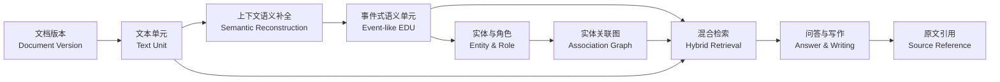
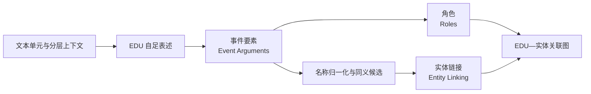
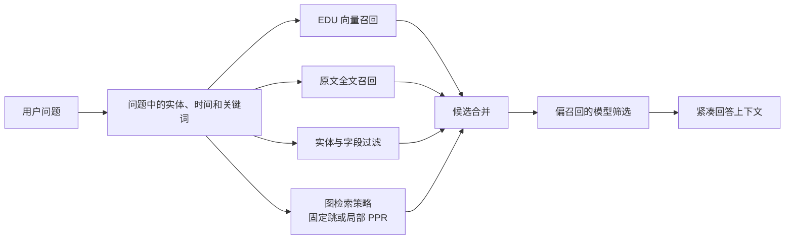
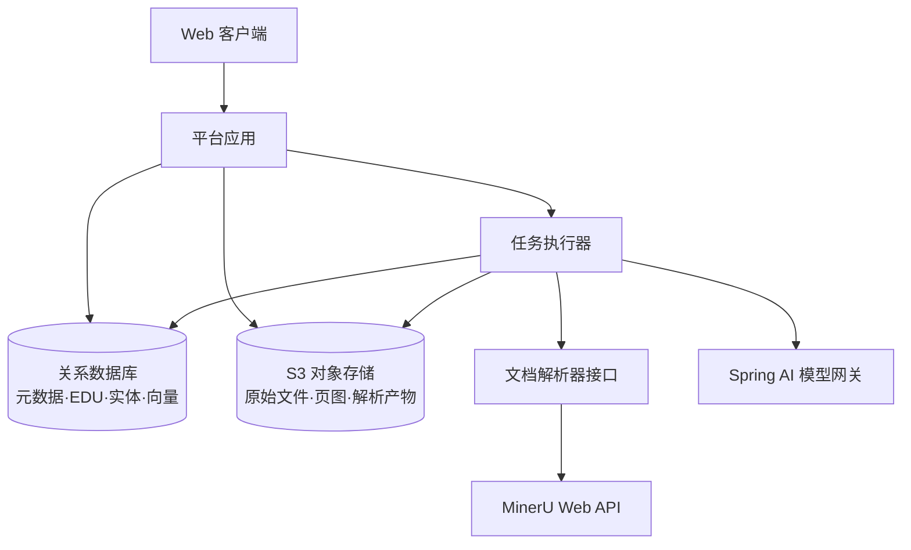
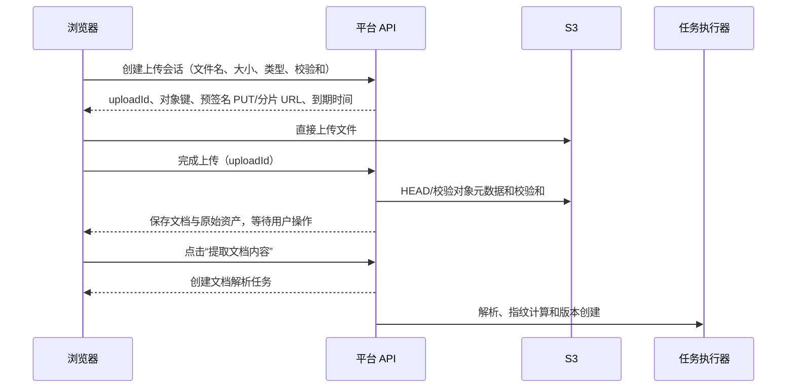

# 溯知（OntoTrace）平台整体规划：事件式语义单元方案

> 文档版本：1.11 设计基线
>
> 修订日期：2026-09-03
>
> 文档性质：从零设计的产品、领域、模型与实施规划
>
> 核心路线：文档 → 事件式语义单元（Event-like EDU）→ 实体关联图（Entity Association Graph）→ 检索与生成 → 原文引用

## 阅读导航

| 主题    | 章节                                                                                        |
| ----- | ----------------------------------------------------------------------------------------- |
| 设计基线  | [定位](#1-平台定位)、[目标与边界](#2-目标与非目标)、[固定决策](#3-固定设计决策)                                        |
| 核心模型  | [领域概念](#5-最小领域模型)、[事件式语义单元](#7-事件式语义单元event-like-edu)、[来源关联](#8-原文关联与语义补全)                |
| 语义组织  | [实体](#9-实体entity与身份归一化)、[关联图](#10-实体关联图entity-association-graph)、[时间](#11-时间地点与语义限定)      |
| 模型与检索 | [模型处理](#12-模型处理与紧凑输出)、[检索](#14-检索与上下文组装)、[问答写作](#15-有据问答与研究写作)                            |
| 产品与工程 | [工作台](#16-产品界面与工作流)、[架构](#17-系统架构)、[技术栈](#172-技术栈选型)、[数据](#18-概念数据结构)、[接口](#19-api-与处理任务) |
| 交付治理  | [质量](#22-质量评测与验收)、[路线](#23-分阶段实施路线)、[风险](#24-主要风险与控制)、[完成定义](#26-设计完成定义)                  |

---

## 0. 文档地位与术语约定

### 0.1 文档地位

本规划重新定义一套独立的平台方案，不以已有代码、数据库、模块、提示词、接口或历史规划为实现前提。已有材料只作为需求来源和经验参考，不构成本规划的数据兼容承诺。

后续若进入实施，应另外形成迁移或重建方案。不能把本规划的概念直接套入既有数据，也不能为了兼容旧对象而恢复已明确删除的复杂层次。

### 0.2 术语书写

产品、领域和界面以中文术语为主。核心术语首次出现时保留英文作为辅助，采用“中文（English）”形式。代码、数据库、接口和模型传输格式可以使用英文标识。

本规划中的 EDU 指“事件式语义单元（Event-like Elementary Discourse Unit）”，不是对传统篇章语言学 EDU 定义的严格实现。

### 0.3 设计取向

平台优先解决三个问题：

1. 模型怎样把依赖上下文的原文转换成可直接理解的信息。
2. 这些信息怎样被检索、关联并用于回答问题。
3. 任何回答怎样回到固定版本的原文。

只有当真实任务证明必要时，才增加新的领域对象、图算法或基础设施。

首期以中文历史材料研究者为主要验证用户，以历史材料为主验证域；现代文档作为迁移探针，分别报告结果，不用跨领域平均分掩盖古籍中的指代、纪年、异体字和实体消歧问题。这是验证优先级，不限制平台以后处理论文、法规和其他材料。

---

## 1. 平台定位

### 1.1 一句话定义

**溯知是以文档为第一公民、以事件式语义单元为核心记忆、以实体关联图辅助检索，并能回到原文的研究与写作平台。**

平台把书籍、论文、报刊、档案、图册、网页快照等材料转换为可检索的语义记忆。用户可以围绕人物、事物、事件、时间和问题组织材料，进行问答、比较、整理和写作。

### 1.2 核心链路



### 1.3 产品价值

- **比普通分块更容易检索**：EDU 比长段落更短、更聚焦。
- **比三元组保留更多语义**：同一事件中的人物、时间、地点、对象和方式不会被拆散。
- **比纯摘要更少丢失细节**：原文不被覆盖，EDU 是重组织后的索引和记忆。
- **比纯知识图谱更适合生成**：检索结果本身是人和模型都能直接理解的完整表述。
- **比模型直接问答更可复核**：EDU 和最终回答都能回到原文位置。

以上是必须被实验验证的产品假设，不是由 EMem 等对话记忆研究自动保证的结论。平台必须在自己的文档语料上与同语料的原文分块 RAG 比较，并同时观察单篇文档、跨文档和大规模文档库中的质量、总成本与重复查询摊销收益。若批量 EDU 不能在检索、跨文档关联、可检查补全或长期成本上形成明确价值，平台应采用第 23 章的降级路线，而不是继续扩大 EDU 工厂。

---

## 2. 目标与非目标

### 2.1 产品目标

1. 独立管理文档、内容版本、解析结果和使用权限。
2. 利用文档上下文补全省略主语、代词、简称、身份和相对时间。
3. 形成短小、自包含、带实体和时间信息的 EDU。
4. 从 EDU 中组织人物、组织、地点、事物、概念和事件关系。
5. 联合原文、EDU、实体和图关联进行检索。
6. 生成能精确回到原文的回答、备忘、提纲和文章。
7. 允许用户纠正错误补全、身份归一化和 EDU 内容。

### 2.2 首期非目标

首期不建设：

- 证据图、研究图、分析图等多层图体系；
- 通用本体编辑器；
- 自动裁定文档内容真假的事实引擎；
- 完整形式逻辑、因果证明或 OWL 推理系统；
- 默认运行的 PPR、图神经网络或智能体式多轮检索；
- 对模型隐式思考过程的持久化；
- 为每种语义中间状态建立独立表和管理界面；
- 阅读或问答过程中自动触发的即时 EDU 抽取；首期只支持用户在文档库显式发起批量处理；
- 宽关系快捷边及其谓词映射体系；首期图只使用 EDU 到实体的固定角色边。

### 2.3 完整性的含义

平台追求在指定文档、范围、模型和预算下尽可能完整地发现信息，不承诺一次抽取覆盖全部含义。

原文始终参与检索。未生成 EDU 不等于原文没有相关信息；首期问答直接使用命中的原文，不在查询链路即时生成 EDU。用户可以回到文档库，显式对指定文档或范围重新执行批量 EDU 抽取。查询时按需抽取只有在批量路线无法覆盖真实需求且生命周期规则经验证后才引入。

---

## 3. 固定设计决策

| 编号  | 决策                               | 直接影响                                       |
| --- | -------------------------------- | ------------------------------------------ |
| D01 | 文档（Document）是独立资源                | 文档可以先导入，再被多个研究项目引用                         |
| D02 | 研究项目固定使用指定文档版本（Document Version） | OCR、清洗或重新解析不会静默改变既有研究依据                    |
| D03 | 原始文件与解析文本始终保留                    | EDU 和图谱不能替代原文                              |
| D04 | 事件式语义单元（EDU）是核心语义记忆              | 不再以证据、指称、命题和解释对象组成长链                       |
| D05 | EDU 表达文档经上下文补全后的含义               | EDU 不自动代表平台认定的客观事实                         |
| D06 | 一个 EDU 保留一个可独立检索的主要语义            | 同一事件的参与者不拆成互相失联的多条事实                       |
| D07 | 来源关联直接保存在 EDU 上                  | 不建设独立证据图                                   |
| D08 | 实体图从文档级 EDU 和文档级实体链接投影           | 项目按所选文档版本过滤图，图可以重建，不形成第二套权威语义              |
| D09 | 事件型 EDU 首期同时承担事件节点职责             | 不预先建立跨来源的全局事件身份系统                          |
| D10 | 生成模型优先一次输出 EDU、事件要素与角色           | 正式实体 ID 由系统生成；默认复核是独立检查，不重复整套抽取              |
| D11 | 图检索采用可切换策略                       | 固定跳是默认策略；局部 PPR 作为实验策略，与固定跳使用同一输入输出并接受消融评测 |
| D12 | 回答引用最终指向原文                       | EDU 是语义桥梁，不是对外引用终点                         |
| D13 | 纠正通过替代 EDU 或修改文档级实体链接完成          | 不为评审另建复杂判断图                                |
| D14 | 一个应用、一个关系数据库和一个文件存储作为实施起点        | 专用图数据库和独立向量数据库按实测引入                        |
| D15 | 文档解析与 EDU 抽取均由用户显式发起              | 文档库提供独立操作和任务状态；首期不在阅读或问答时自动抽取              |
| D16 | EDU 默认由模型复核，人工复核不作为流程卡点          | 满足显式低风险规则后可进入默认检索；人工按需复核并可覆盖模型结论            |
| D17 | 项目关注实体是可选的软优先级                    | 可以为空；只影响人工候选展示、查询扩展和结果排序，不改变自动实体链接结论      |
| D18 | 首期 EDU 全部是单一固定文档版本内的文档级语义记录       | 项目问题、笔记和解释只进入检索、回答与研究成果，不参与 EDU 生成          |
| D19 | Entity 共享，实体链接结论按固定文档版本保存          | 引用同一版本的项目复用相同链接；项目不生成或覆盖自己的实体链接            |
| D20 | 开放谓词不是首期主召回键                       | 谓词用于展示和精确筛选；主召回依赖原文、EDU、实体和固定角色边             |

---

## 4. 产品对象与主要工作流

### 4.1 文档库

用户导入文件、网页快照或纯文本，补充题名、作者、出版信息和材料类型。平台先保存原始资产和文档记录；用户显式发起内容提取后，平台才生成不可变文档版本，并解析为具有稳定顺序和位置的文本单元。

重复内容只提示，不阻止上传。相同内容可以复用底层资产，但不同用户、书目信息和权限仍保留各自的文档记录。

文档详情提供两个显式操作：

- **提取文档内容**：生成新的不可变文档版本、文本单元和页图映射；PDF、Office、图片和 HTML 调用选定解析器，TXT、Markdown 使用平台内置文本导入器，不调用外部解析器；
- **抽取 EDU**：对选定文档版本和范围创建批量任务，按文本单元与分层上下文生成、校验并复核 EDU。

两个操作互不自动串联。用户可以只解析并阅读原文，也可以在确认版本后再启动 EDU 抽取；每次操作都显示预计范围、预算、处理配置和任务状态。

文档库支持多选文档后批量发起同一种操作，并汇总展示预计范围和预算。一次界面操作仍为每份文档创建普通独立任务，失败和重试互不影响；首期不增加批次领域对象，也不自动把内容提取与 EDU 抽取串联。

### 4.2 研究项目（Project）

研究项目围绕一个问题组织若干文档版本。用户可以限定章节、页码或文本范围，按需从平台共享实体池中添加项目关注实体（Project Focus Entities），并设置时间背景、语义词汇和模型预算。

项目关注实体完全可选，可以为空。它只为人工链接界面的候选展示、查询扩展和结果排序提供软优先级，不参与自动实体链接，也不是实体白名单，不限制文档内容提取、EDU 抽取或新实体发现。需要把问题严格限制在某些实体时，由用户在单次检索中显式设置过滤条件，不改变项目的长期配置。

在项目内上传文档，等价于先建立文档；内容提取完成后，再把用户选定的固定版本加入项目。

### 4.3 阅读与语义补全

文档解析完成后，用户可以在文档库对整个版本或指定范围发起 EDU 抽取。系统仍按原有逻辑把文档拆成多个 Text Unit，以一个句子、段落或一组连续文本为分析目标，并组合标题、前后文、传主身份和文档内纪年范围形成上下文。首期 EDU 全部只使用文档固有上下文生成，实体链接同样只依据固定文档版本的内容和平台共享实体池形成。项目关注实体不进入 EDU 生成或自动实体链接上下文，也不改变可复用的文档级 EDU 和实体链接。

首期不在用户实际阅读或问答时即时抽取 EDU，避免查询偏置、重复 EDU、合并规则和交互延迟同时进入主链路。需要补充 EDU 时，用户回到文档库显式重跑选定范围。

阅读器并列显示：

- 固定版本原文；
- EDU 的自足表述；
- 结构化参与者、时间和地点；
- 发生过的补全；
- 原文引用位置；
- 当前采用状态。

### 4.4 实体与事件浏览

用户可以围绕一个实体查看：

- 原文中的不同称呼；
- 参与的事件型 EDU；
- 与其他实体的关系型 EDU；
- 时间分布；
- 来自不同文档的相关表述。

事件浏览以事件型 EDU 为基本记录，不要求先把多个来源强行合并为一个“真实事件”。

### 4.5 问答与写作

平台联合检索原文和 EDU，使用实体图补充相关内容，再由模型筛选真正相关的上下文。回答中的关键表述链接到 EDU，并最终展开为文档版本、原文摘录和位置。

用户可以把检索结果和回答保存为研究备忘、提纲或文章。保存的研究成果不自动反向成为来源材料；用户显式导入后，才作为一份新的文档参与后续研究。

### 4.6 修正

用户可以：

- 有文档编辑权限时，修改 EDU 的自足表述和结构化字段；
- 有文档编辑权限时，把固定文档版本中的错误实体链接改到正确实体；
- 有平台级实体管理权限时合并或拆分共享 Entity；
- 拒绝错误 EDU；
- 重新处理指定原文范围。

已经用于回答或文章的 EDU 被替代后，相关成果显示“需要复核”，但历史版本仍可查看。实体链接修改不自动改写已经保存的回答或文章。

EDU 生成后的默认流程是确定性校验加大模型复核。模型复核检查忠实性、遗漏、指代、时间、角色和禁止推断；只有满足第 12.6 节显式低风险规则且复核通过的 EDU 才自动进入 `Active`，其他项保持 `Proposed` 并按疑点或影响进入队列。人工复核按需进行，不阻塞批量处理；人工结论优先于模型结论，通过替代 EDU 或修改文档级实体链接生效，覆盖时必须保存修改前版本、操作者和理由。模型复核不得把模型自报置信度当作证据，也不得直接覆盖已有 EDU。

---

## 5. 最小领域模型

### 5.1 核心概念

| 概念                      | 定义                            | 不承担的职责           |
| ----------------------- | ----------------------------- | ---------------- |
| 文档（Document）            | 一条可独立管理的书籍、论文、档案、网页快照或其他材料记录  | 不以题名或哈希值充当唯一业务身份 |
| 文档版本（Document Version）  | 原始资产和解析结果的一份不可变快照             | 不覆盖旧版本           |
| 研究项目（Project）           | 围绕问题选择文档版本、实体和研究成果的空间         | 不拥有或修改共享原文       |
| 文本单元（Text Unit）         | 文档版本中稳定、有顺序和位置的文本或结构单元        | 不限制模型必须只理解本单元    |
| 事件式语义单元（Event-like EDU） | 从原文和上下文中重建出的短小、自足语义记忆         | 不自动等于客观事实        |
| 实体（Entity）              | 在平台内跨文档、项目和 EDU 复用的规范对象           | 不直接保存有争议的事件事实，不归属于单一项目 |
| 来源引用（Source Reference）  | EDU 到固定文档版本和原文片段的位置关联         | 不形成独立证据领域        |
| 研究成果（Research Artifact） | 问答、备忘、提纲或文章及其引用映射             | 不自动进入文档语义图       |
| 处理运行（Processing Run）    | 一次具有确定输入、模型、提示版本和产物的处理活动      | 不承载领域事实          |

这九个概念构成平台首期的研究领域边界。时间、地点、参与角色、补全说明和审核状态作为 EDU 的组成部分，不单独扩展为完整子系统。

### 5.2 被取消的核心对象

本规划不把以下概念建设成独立领域对象：

| 原概念                  | 本规划处理方式          |
| -------------------- | ---------------- |
| 证据（Evidence）         | 由来源引用表达          |
| 证据锚点（Anchor）         | 由来源引用中的位置和摘录表达   |
| 原文指称（Mention）        | 由 EDU 参数的原文写法表达  |
| 来源命题（Claim）          | 由 EDU 的自足表述承担    |
| 解释记录（Interpretation） | 由 EDU 的补全说明承担    |
| 对象解析（Resolution）     | 由 EDU 参数到实体的链接承担 |
| 项目关系（Relation）       | 由 EDU 结构投影的图边承担  |
| 事件框架（Event Frame）    | 与事件型 EDU 合并      |
| 分析发现（Finding）        | 保存在研究成果正文及引用中    |

如果未来某项信息产生了独立查询、权限、版本或评审需求，再考虑提升为领域对象。在此之前不为概念对称性增加对象。

### 5.3 作用域

| 作用域 | 内容 |
| --- | --- |
| 平台级 | 单一工作空间内共享的实体池及名称 |
| 文档级 | 文档版本、文本单元、仅依赖该版本上下文的 EDU 和实体链接 |
| 项目级 | 选定文档版本、项目关注实体、项目配置和研究成果 |
| 成果级 | 回答、备忘、提纲、文章及其引用映射 |
| 运行级 | 输入范围、提示版本、模型参数、费用、错误和产物摘要 |

首版按单一工作空间部署，不引入组织层级或额外的数据边界对象。Entity 不属于任何项目，而属于平台共享实体池。项目关注实体只是项目对一批 Entity 的可选标记，不建立另一份 Entity 副本，也不成为独立领域对象。添加或移除关注只改变人工候选展示、查询扩展和结果排序，不修改 Entity、既有 EDU 或实体链接。

首期每条 EDU 只属于一个固定文档版本，只使用该版本内部上下文生成，并在权限允许范围内复用；同一 EDU 可以引用该版本内多个原文片段，但不跨文档版本。项目关注实体、项目笔记或跨文档背景只影响人工候选展示、检索、回答与研究成果，不参与 EDU 生成或自动实体链接；确实依赖项目解释才能成立的内容属于研究成果，不生成项目级 EDU。项目级 EDU 只有在真实任务证明研究成果不足以承载、且作用域、去重和检索优先级均已验证后才引入。

实体身份在平台内共享，实体链接结论绑定固定文档版本中的 EDU 参数：文档级 `edu_argument` 保留角色、原文写法、规范值和建议类型，文档级链接记录把具体参数连接到共享 Entity。同一文档版本被多个项目使用时复用相同链接，项目不生成或覆盖自己的链接。无法仅凭文档上下文可靠认定的参数保持未链接；依赖跨文档证据或研究立场的身份假说保存在研究成果中。

---

## 6. 文档、版本与文本组织

### 6.1 文档类型

平台至少支持书籍、论文、报刊、档案、网页快照、图册和通用文档。材料类型与文件格式分开，例如书籍可以是 PDF、EPUB 或纯文本。

首期优先支持：

- TXT 和 Markdown；
- 具有文本层的 PDF；
- 扫描 PDF 的 OCR 结果；
- 通过统一接口导入的网页快照。

首期质量门以中文材料为主。现代中文文档用于迁移验证；英文及其他语言只有在提示、分词、嵌入与金标准分别覆盖后才声明支持。

### 6.2 文档版本

文档版本固定：

- 原始文件或资产清单；
- 文件内容指纹；
- 解析后的文本；
- 页面、段落和阅读顺序；
- OCR 或解析方法及版本；
- 创建时间和创建者。

重新 OCR、修复阅读顺序或修改清洗规则时创建新版本。旧 EDU 继续关联旧版本，不自动漂移。

项目切换文档版本时必须由用户显式选择，先显示受影响的 EDU、实体链接和研究成果，再对新版本重新执行所需处理。旧成果继续引用旧版本；首期不做基于文本 diff 的自动 EDU 迁移。

### 6.3 内容指纹与重复

平台分别计算原始资产指纹和规范文本指纹：

- 原始资产指纹用于判断文件是否完全相同；
- 规范文本指纹用于发现不同文件包装下的近似重复内容。

重复检测只用于提示和底层存储复用，不阻止不同用户建立同名或同内容文档。

### 6.4 文本单元（Text Unit）

文本单元是稳定定位和检索的基础，可能是：

- 篇、章、节；
- 段落；
- 表格、图注或脚注；
- OCR 页面区域；
- 无法进一步可靠切分的文本块。

文本单元不是固定词元分块。用于模型理解的上下文窗口可以跨越多个文本单元，并根据标题、人物、纪年、用户选定范围和上下文策略动态组装。项目问题、笔记和跨文档解释不进入首期 EDU 生成上下文，只用于项目内检索、回答和研究成果。

### 6.5 原文始终可检索

全文索引覆盖全部可访问原文。EDU 未生成、生成失败或被拒绝时，原文仍可命中；首期问答使用原文结果继续回答，并提示该范围尚无可用 EDU，不自动触发语义处理。

---

## 7. 事件式语义单元（Event-like EDU）

### 7.1 定义

事件式语义单元是模型在指定原文和上下文范围内，对一项可独立理解、可独立检索的信息进行忠实补全后形成的语义记忆。

EDU 的核心不是“尽可能短”，而是在检索粒度和语义完整性之间取得平衡：

```text
三元组：过碎，容易丢失时间、角色和共同事件
EDU：短小、自足，保留一次事件或一项状态的内部结构
长分块：信息密度低，召回后仍需重新理解整段
```

### 7.2 EDU 类型

| 类型             | 含义                | 示例                |
| -------------- | ----------------- | ----------------- |
| 事件（Event）      | 发生、变化、行动或过程       | 李世民于武德八年被加授中书令    |
| 状态（State）      | 某一时点或区间内的身份、职位或属性 | 武德九年的叙事时点，李建成是皇太子 |
| 关系（Relation）   | 实体之间相对稳定或被来源表达的关系 | 甲是乙之父             |
| 评价（Evaluation） | 作者、说话者或来源给出的评价    | 该来源评价其施政简肃        |
| 规则（Rule）       | 条件、义务、许可、禁止或制度性规定 | 申请人应在三十日内提交材料     |

不是所有文档都以事件为主。法规、论文、评论和人物偏好可以使用状态、关系、评价或规则类型，不能为了统一格式强行事件化。

### 7.3 EDU 的基本内容

一个 EDU 至少包含：

| 字段    | 说明                          |
| ----- | --------------------------- |
| 类型    | 事件、状态、关系、评价或规则              |
| 自足表述  | 不依赖“他”“之”“当年”等未解释表达即可理解的短文本 |
| 主要谓词  | 对该 EDU 的主要行为、状态或关系给出简短开放语义标签 |
| 参数与角色 | 主体、对象、参与者、地点、工具、结果或值等         |
| 时间    | 原文时间、规范时间、精度和解析状态           |
| 语义限定  | 否定、可能、计划、转述、条件、评价主体等必要信息    |
| 来源引用  | 固定版本中的一个或多个原文片段             |
| 补全说明  | 仅记录发生过的实体、指代、时间或省略补全        |
| 状态    | 候选、采用、拒绝或被替代                |
| 处理来源  | 产生该 EDU 的处理运行及人工修改信息        |

### 7.4 粒度规则

一个 EDU 应围绕一项可独立回答的问题。以下情况通常拆分：

- 一个句子同时包含两个互不依赖的事件；
- 一项身份陈述和一个后续行动可以分别被检索；
- 作者评价与被评价事件的责任主体不同；
- 条件、否定或转述跨越后会改变另一项语义。

以下情况通常不拆分：

- 同一事件的多个参与者；
- 同一事件的时间、地点、原因和对象；
- 一个动作的领导者、执行者和对象；
- 拆分后必须重新拼装才能回答的共同事件信息。

阶段 A 的金标准至少由两名标注者独立应用以上规则，并报告 EDU 边界、拆分和合并的一致性及主要分歧。若人工边界不能稳定复现，粒度规则只能作为模型提示启发式，不能作为硬验收标准；平台应优先让 EDU 服务检索，不为保持单一对象而强行承担不兼容的展示或修正粒度。

### 7.5 自足表述

EDU 的自足表述可以补全：

- 省略的主语或宾语；
- 代词和指示词；
- 简称、人物的字、庙号、官职性称谓等；
- 从明确上下文继承的年号和年份；
- 文档结构提供的章节主题或发言者。

自足不等于自由扩写。模型不得补入原文及给定上下文没有支持的动机、结果、评价或精确日期。

### 7.6 事件型 EDU 与事件身份

首期中，一个事件型 EDU 本身就是一个来源特定的事件记录。不同文档对同一历史事件形成不同 EDU，通过共同实体、时间、地点、谓词和语义相似度关联。

平台不在写入时强制判断它们是否是同一个客观事件。只有当跨来源事件聚合已经产生明确产品价值，并有可验证的合并规则时，才增加事件簇（Event Cluster）。

### 7.7 状态与修正

EDU 使用四种状态即可：

| 状态              | 含义             |
| --------------- | -------------- |
| 候选（Proposed）    | 模型已生成，尚未采用     |
| 采用（Active）      | 可进入默认检索与图投影    |
| 拒绝（Rejected）    | 被判断为错误或对所有使用范围均无有效信息 |
| 被替代（Superseded） | 已有新的 EDU 取代其语义 |

修改已采用 EDU 时创建替代版本，并保存 `supersedes` 关系。首期不建设独立评审决定对象。

`Rejected` 是文档级质量结论，不能用来表达“与当前项目无关”。项目只通过所选文档范围、查询条件和结果排序控制相关性；首期不增加项目级 EDU 隐藏或排除记录。

状态表示 EDU 是否参与产品流程，不表示谁完成了审核。EDU 另保存最近复核来源、复核结果和复核运行：

- 确定性校验失败的输出不进入 EDU 状态机，只作为处理运行附件；
- 确定性校验通过后，由复核模型检查语义质量；满足第 12.6 节显式规则且复核通过的 EDU 自动进入 `Active`；
- 复核模型发现疑点时保持 `Proposed`，供后续模型重审或人工按需处理；
- 人工复核不是进入 `Active` 的必要条件，但人工结论优先，并通过替代 EDU 或修改文档级实体链接生效；
- 模型复核和人工复核都复用 EDU 的版本、状态和运行记录，不建立独立评审领域对象。

---

## 8. 原文关联与语义补全

### 8.1 来源引用（Source Reference）

来源引用直接属于 EDU，至少保存：

- 文档版本标识；
- 文本单元标识；
- 原文摘录；
- 可验证时的字符范围；
- PDF 页码或 OCR 区域；
- 定位精度；
- 在该 EDU 中的用途。

用途只需区分：

- 主要原文；
- 补全上下文。

来源引用不是独立知识节点，不需要单独的生命周期和评审界面。

### 8.2 一个 EDU 可以引用多个片段

省略主语、跨句指代和时间继承可能依赖多个不连续位置。例如“八年，加中书令”可能需要：

- 当前句说明任职变化；
- 篇章标题或传主上下文说明主语；
- 前文说明年号。

这些片段共同属于同一个 EDU 的来源引用，不再构造证据组或证明链。

### 8.3 补全来源

补全按来源分为三类：

| 补全来源              | 含义                      | 默认处理       |
| ----------------- | ----------------------- | ---------- |
| 原文直接（Explicit）    | 当前原文已经明确出现              | 直接采用       |
| 上下文补全（Contextual） | 可以由提供的标题、邻文、文档内人物说明或纪年上下文补足 | 记录简短补全说明   |
| 外部知识（External）    | 只能依赖模型参数知识或项目外资料        | 默认不作为已采用补全 |

用户可以显式允许外部知识提出候选，但必须标记来源，不能把模型记忆伪装成文档原文已经表达的内容。

### 8.4 补全说明

补全说明只在规范结果与原文表面形式不一致时记录，例如：

```text
太宗 → 李世民，依据：本篇传主上下文
之 → 李建成、李元吉，依据：前句共同宾语
六月四日 → 武德九年六月四日，依据：前句年份继承
```

补全说明不是模型思维链。它只保存用户能够检查的结果、原文形式和依据位置。

### 8.5 定位校验

模型只需要返回原文摘录和输入中已有的 `contextKey`。系统在原文中定位摘录并生成稳定位置。无法精确定位但 `contextKey` 仍能确定来源文本单元或页面时，可以退化到相应层级，界面必须显示定位精度。

定位结果只分三级：

1. 精确命中：摘录能在指定解析文本中定位，并生成字符范围；
2. 降级定位：只能确认对应文本单元或页面，不能声称字符级命中；
3. 定位失败：无法建立可核查的文本单元或页面关联，不得自动进入 `Active`。

降级定位时，来源引用展示解析器返回的文本单元或页面内容；模型返回但无法命中的摘录只保存在处理运行附件中供比较，不能标成原文摘录。

模型不能自行生成永久标识、数据库主键、内容哈希或可信字符偏移。

首期把解析器返回的标准化文本视为该文档版本的可引用文本，不自行判断 OCR 字符是否忠于页面图像，也不建设 OCR 质量评分。平台仍须检查模型返回的摘录确实存在于解析器返回的对应文本单元；无法精确命中时只允许降级到解析器给出的文本单元或页面位置，不能用模糊相似度把模型改写自动认定为原文。重新 OCR 或人工修复文本时创建新文档版本。三级定位分布是引用质量和复核负荷指标，不是 OCR 字符正确率。

### 8.6 语义边界

EDU 表示“该文档在给定上下文中表达了什么”。同一事件在不同文档中的 EDU 可以互相矛盾，并且都可以被采用。

平台回答问题时负责比较和综合，不通过覆盖 EDU 的方式选择唯一事实。

---

## 9. 实体（Entity）与身份归一化

### 9.1 实体类型

首期使用少量开放类型：

- 人物（Person）；
- 组织（Organization）；
- 地点（Place）；
- 事物（Object）；
- 作品或文档（Work）；
- 职位或称号（Role）；
- 概念（Concept）；
- 未分类（Other）。

类型用于检索和展示，不作为复杂本体约束。领域出现稳定需求后再增加类型。

### 9.2 EDU 参数

EDU 参数同时保留：

- 角色，例如主体、对象、参与者、地点；
- EDU 中使用的规范显示值；
- 原文写法，例如“太宗”“建成”“之”；
- 建议实体类型；
- 是否经过上下文补全。

这样可以直接表达“太宗在当前 EDU 中被补全为李世民”，不需要单独的原文指称对象。正式实体链接以 EDU 参数为归属另行保存，不写回抽取结果，也不附加项目作用域。

### 9.3 实体链接

模型在 EDU 参数中输出规范值、原文写法和建议实体类型。系统随后尝试链接：

1. 平台共享实体池中的规范名称和别名精确匹配；
2. 类型、时间和共同事件约束；
3. 向量或模型候选判断；
4. 无法可靠确定时保留未链接的事件要素值或待处理实体候选。

链接结果保存为固定文档版本中的 EDU 参数与共享 Entity 之间的关联。同一文档版本在所有引用它的项目中复用相同链接；项目关注实体不参与自动链接，也不能产生项目级覆盖结论。

项目关注实体为空不影响 EDU 抽取或实体链接；即使共享实体池也为空，模型输出的原文写法、规范值和类型仍保存在 EDU 参数中，无法可靠链接的内容保留为未链接值或实体候选。实体池完善后可以针对固定文档版本重新执行实体链接和图投影，不需要重新抽取 EDU。

系统不因字符串相同自动合并，也不要求模型直接创建正式实体。链接默认宁缺毋错；未链接值继续参与原文和 EDU 检索。冷启动时以当前文档传主和高频未链接候选为种子，经模型复核或人工确认后进入平台共享实体池。项目关注实体可以在人工链接界面中优先展示，但不能提高自动链接置信度；用户确认链接时修改的是文档级记录，必须具有文档编辑权限。新识别实体不自动成为项目关注实体，由界面提供按需添加操作。

### 9.4 合并与拆分

错误实体链接在固定文档版本内解除或改链；只有确认两个共享 Entity 表达同一身份时才执行实体合并，实体误合并时可以拆分。文档级链接修改会影响该版本后续在所有项目中的检索和图投影，因此必须校验修订号并保留操作日志，但不自动改写已经保存的研究成果。

共享 Entity 的合并与拆分需要平台级实体管理权限。操作前显示受影响的文档版本、EDU 和实体链接数量；预览遵守资源权限，不能向无权用户泄露来源详情。已发布研究成果保留原正文和来源引用，不自动改写。首期不建立跨项目覆盖、复杂的可撤销身份推理网络或变更通知中心。

平台共享实体池是当前部署内的身份索引，不是全球唯一实体库，也不表示平台对有争议身份作出权威裁定。

### 9.5 称谓与职位

“太宗”“皇太子”“齐王”可能承担不同作用：

- 作为原文称呼，保存在 EDU 参数的原文写法中；
- 作为身份或职位，形成独立状态型 EDU；
- 作为实体检索别名，经人工或可靠上下文加入实体名称表。

不能仅因为一个字符串曾作为称谓出现，就把相应职位永久写进人物实体档案。

---

## 10. 实体关联图（Entity Association Graph）

### 10.1 图的定位

实体关联图是 EDU 和实体的可重建查询视图，不是独立的事实账本。

```text
EDU 是语义权威记录
实体是跨 EDU 的身份索引
图边来自 EDU 参数和文档级实体链接
原文是最终复核依据
```

首期不建设证据图、研究图和分析图，也不为图部署专用数据库。

### 10.2 EDU、事件要素、角色与知识图谱的关系

本平台采用论文中“先形成 EDU，再抽取事件要素与角色，最后组织为图”的核心逻辑，但不照搬论文的全部节点和调用方式。



四者的职责如下：

| 内容                   | 职责                                    |
| -------------------- | ------------------------------------- |
| EDU                  | 保存一项完整、可读、可检索的事件或命题语义                 |
| 事件要素（Event Argument） | 从 EDU 中识别人物、组织、地点、时间、对象、职位等参与项        |
| 角色（Role）             | 说明一个事件要素在 EDU 中承担什么作用，例如主体、对象、参与者或地点 |
| 知识图谱                 | 把 EDU 通过带角色的边连接到规范实体，支持关联检索和浏览        |

事件要素和角色是 EDU 的结构化组成，不是与 EDU 并列的第二套语义记录。首期在同一次模型调用中同时产生 EDU、事件要素和角色；概念上分步，工程上不强制进行两次模型调用。

论文的同义词检测发生在事件要素抽取之后，用于连接含义相近的 Argument 节点。本平台把这一步扩展为实体归一化：精确名称、别名、上下文身份、类型、向量相似和必要的模型判断共同产生实体候选。“太宗”和“李世民”属于上下文身份解析，不只是字符串同义词。

同义词检测不是形成知识图谱的唯一前提。只要 EDU 已经具有事件要素和角色，并且其参数在固定文档版本内可靠链接到 Entity，就可以形成 `EDU → Entity` 边；名称归一化的作用是让不同 EDU 指向同一实体，提高图的连通度。无法可靠归一化的事件要素继续保存在 EDU 中并参与文本、向量检索，不因未链接而丢弃。

与论文 EMem-G 的具体差异是：

- 论文以 Session、EDU、Argument 为节点；平台首期只把 EDU 和稳定实体作为核心图节点，文档与文本单元通过来源引用导航。
- 论文可以为每个事件要素保留独立 Argument 节点；平台优先把事件要素链接到规范实体，时间、数量和持续时长等值保留为 EDU 属性。
- 论文使用同义词边连接相似事件要素；平台优先合并到同一实体，只有未决候选需要保留相似度。
- 论文 EMem-G 使用 EDU 与事件要素双通道召回及 PPR；平台采用 EDU、原文、实体三通道召回，图检索提供固定跳和局部 PPR 两种可切换策略，局部 PPR 是否进入默认路径由评测决定。

因此，本规划采用论文的表示思想和双入口检索思想，但不预先采用独立 Argument 图和固定两阶段模型调用，也不把 PPR 设为所有查询的默认路径。

### 10.3 节点

图中只需要两类核心节点：

```text
EDU
Entity
```

文档版本和文本单元可以作为过滤属性或来源导航，不必全部变成图节点。时间首先作为 EDU 的结构化字段，不必建立庞大的时间节点网络。

### 10.4 边

核心边由 EDU 的事件要素和文档级实体链接产生。参数值已经链接为 Entity 时，按第 12 章的粗粒度固定角色生成对应边；`subject`、`object`、`participant`、`location`、`origin`、`destination`、`instrument`、`value` 和 `other` 均适用。时间值继续保存在 EDU 字段中，不重复生成实体边。

以下仅为非穷举示例：

```text
EDU ──subject─────→ Entity
EDU ──object──────→ Entity
EDU ──participant─→ Entity
EDU ──location────→ Entity
EDU ──value───────→ Entity
```

具体谓词仍可使用“谋害”“任职”“出生于”等开放词汇。无法归入固定角色的事件要素使用 `other`，并在可选的 `roleName` 中保留模型识别出的原始角色名称，不因词表缺失丢弃 EDU。首期不提供项目自定义角色体系。

### 10.5 实体关系投影

首期不从开放谓词生成 `opposedTo`、`appointedTo` 等实体间宽关系快捷边。固定角色的 `EDU → Entity` 边已经能够支持实体到 EDU 再到其他实体的关联检索，避免同时维护开放谓词、宽关系词表和映射规则。

只有固定角色图在明确查询上稳定漏召回，且宽关系映射经过金标准验证后，才增加语义投影。届时每条快捷边必须回到产生它的 EDU，保留原始谓词、时间、否定、条件和来源，并且不得成为独立编辑的事实记录。

### 10.6 事件之间的关系

事件先后、因果、组成和响应关系可以使用关系型 EDU 表达，其参数允许引用其他 EDU。例如：

```text
U8：事件 U5 发生在事件 U4 之后。
```

只有文档明确表达或上下文可以可靠补全时才生成。首期不根据时间排序自动推断因果关系。

### 10.7 跨来源关联

不同来源的事件型 EDU 通过以下信号关联：

- 共享实体；
- 时间重叠；
- 地点相同；
- 文本向量相似；
- 用户手工关联。

这些信号用于检索和候选聚类，不默认合并记录。

### 10.8 图查询范围

图查询只在当前项目选定且用户有权访问的文档版本内运行；文档级链接由项目范围过滤，不复制为项目图数据。默认使用一到两跳固定扩展：

```text
实体 → 相关 EDU → 其他参与实体
EDU → 共享实体 → 相关 EDU
```

复杂、多种子和多路径问题可以切换到查询级局部 PPR。两种方式都必须设置节点数、边数、跳数、时间和返回数量预算，不对项目全图进行无约束扩展。

---

## 11. 时间、地点与语义限定

### 11.1 时间的最小表达

每个 EDU 的时间字段可以包含：

- 原文时间表达；
- 规范显示值；
- 起止范围；
- 精度，例如年、月、日或未知；
- 历法或纪年体系；
- 解析状态；
- 补全说明。

不要求所有 EDU 强行具有精确时间。状态至少区分：

- 已解析；
- 仅有原文时间；
- 可继承但不确定；
- 未知；
- 不适用。

### 11.2 时间用途

必须区分：

- 事件发生时间；
- 状态有效时间；
- 文档出版或形成时间；
- 作者回忆或观察时间；
- 平台处理时间。

文档发表于 2025 年，不能因此把文档讨论的唐代事件标为 2025 年发生。

### 11.3 时间继承

“九年”后出现“六月四日”时，可以根据连续叙事提出年份继承；“八年”不能跨越新的年份标记继续继承。

继承结果必须出现在补全说明中。无法可靠转换古代历法时保留原始纪年和精度，不能制造伪精确公历日期。

年号、干支与公历转换作为后续可调用的时间转换工具，不属于首期 EDU 生成的隐式能力。工具结果是带算法版本、输入依据、精度和不确定性的派生值，不覆盖原文时间表达；没有足够输入时必须返回未知或候选范围。

### 11.4 地点

地点既可以链接到实体，也保留原文写法。地点层级和现代行政区划不在首期自动展开；只有检索需要时才增加父子地点关系。

### 11.5 否定、模态与责任主体

EDU 必须保留会改变事实含义的限定：

- 否定；
- 计划、企图、可能、据称；
- 条件和例外；
- 引述者或评价主体；
- 范围词，例如“皆”“部分”“等”。

“谋害”不能改写成“已经杀害”，“等”不能改写成完整名单，“天下大悦”不能改写成经过统计验证的全民态度。

---

## 12. 模型处理与紧凑输出

### 12.1 模型职责

模型负责：

- 理解原文和上下文；
- 生成自足 EDU；
- 从 EDU 中识别主要谓词、事件要素和角色；
- 补全指代、省略和相对时间；
- 给出事件要素的规范值、原文写法和建议实体类型；
- 标记不确定或需要外部知识的内容。

系统负责：

- 构造和隔离输入上下文；
- 定位原文摘录；
- 生成标识和哈希；
- 校验结构和引用；
- 链接正式实体；
- 去重、版本和持久化；
- 权限、预算和运行记录。

### 12.2 默认单次调用

首期默认一次模型调用同时返回 EDU、事件要素和角色。原因是自足表述、时间、指代和角色本来就依赖同一次上下文理解，机械拆成多轮会增加费用和漂移。实体去重和正式链接在模型调用后由系统完成。

阶段 A 必须比较单次结构化输出、先生成 EDU 文本再抽取要素，以及只生成 EDU 文本三种方式。默认模型复核是对候选结果的独立检查，不重新执行整套抽取；生成与复核的总费用都计入每条可用 EDU 成本。无复核、同模型复核、跨模型复核和较小模型复核作为实验消融分别报告；无复核只用于测量复核净收益，不作为正式自动采用路径。

复核至少使用与生成不同的提示和输出契约，不读取模型的隐式推理。阶段 A 在金标准和分层人工抽样上比较各组合的疑点命中率、通过桶漏错率、复核后残余错误率和成本，再决定默认组合；不能仅凭模型间推翻率高低判断优劣，尤其要单独报告禁止外部知识样本，避免把共享参数偏见当作相互确认。

只有当固定评测证明生成质量明显受益时，才把生成阶段拆分为：

- EDU 生成；
- 事件要素与角色抽取；
- 实体链接。

默认模型复核发生在确定性校验之后，是不改写原结果的质量检查，不属于生成阶段拆分。不能为了形成“智能体流程”而增加无收益调用。

### 12.3 输入上下文

一次调用使用分层上下文包。每层有明确标签、用途和长度预算：

| 上下文层                   | 内容                     | 用途               | 默认优先级      |
| ---------------------- | ---------------------- | ---------------- | ---------- |
| 分析目标（Target）           | 当前需要提取的句、段或文本单元        | EDU 的主要原文        | 最高，不能被摘要替代 |
| 相邻上下文（Neighbors）       | 前后若干文本单元               | 指代、省略、连续事件和时间继承  | 高          |
| 所属篇章（Section）          | 标题、摘要、简介、传主说明及当前结构路径   | 确定当前文章、章节主题和叙述主体 | 高          |
| 文档概览（Document Summary） | 当前文档版本的简短总结、时代、主要对象和体裁 | 提供全局语境和消歧线索      | 中          |
| 输出规则（Task Rules）       | EDU 类型、角色建议和输出契约       | 约束模型行为           | 固定         |

文档概览和篇章简介可以由原文、人工书目信息或模型预处理产生，但它们属于补全上下文，不能替代主要原文，也不能单独证明某个 EDU。模型生成的总结必须固定到文档版本并记录生成方法。

上下文按总词元预算裁剪，推荐顺序是：完整保留分析目标，优先保留直接相邻文本和所属篇章，再加入文档概览。分析目标过长时先切成多个重叠目标，不通过压缩目标原文给背景让路。项目关注实体、项目问题、笔记和跨文档背景不进入首期 EDU 生成或自动实体链接上下文，只用于人工候选展示、检索、回答和研究成果。

初始预算可以按比例控制：分析目标约占 35%～50%，相邻上下文约占 20%～30%，所属篇章约占 10%～15%，文档概览约占 5%～10%。比例是可测参数，不写死在领域模型中。

实际输入使用稳定标签明确区分各层，例如：

```text
[DOCUMENT_SUMMARY key=document-summary purpose=context-only]
《旧唐书》相关传记，当前叙事使用武德纪年，传主为李世民。

[SECTION key=section-intro purpose=context-only]
当前文本位于传主生平纪事部分。

[NEIGHBOR key=previous-1 purpose=context-only]
九年，皇太子建成、齐王元吉谋害太宗。

[TARGET key=target purpose=primary-source]
六月四日，太宗率长孙无忌……于玄武门诛之。
```

模型输出通过 `contextKey` 指出原文摘录来自哪个输入文本块。`contextKey` 只用于本次传输定位，系统接收后将其解析为文档版本、文本单元和原文位置。

模型不需要用 `basis` 自述自己受哪一层上下文影响。规范值与原文写法不同时，`value` 与 `sourceForm` 已经表明发生了补全；处理运行保存完整上下文包及其内容指纹，实体链接过程按需记录链接方法和可检查的补全说明。

### 12.4 紧凑输出原则

- 输入原文不在输出中反复复制，只返回必要摘录。
- 不要求模型创建局部实体 ID 或维护跨数组引用。
- 同一事件的参与者共享一个 EDU。
- 事件要素直接携带规范值和原文写法，不要求模型输出笼统的上下文依据列表。
- 时间、地点和语义限定直接嵌入 EDU。
- 不输出系统可以确定的数据库标识和字符偏移。
- 不输出模型长推理过程。

#### 12.4.1 粗粒度角色

角色需要稳定，才能支持统一校验、图遍历、角色过滤和后续的 PPR 排序；但不为每一种事件建立专用角色本体。首期固定以下粗粒度词表：

| 中文角色  | 代码值           | 含义                 |
| ----- | ------------- | ------------------ |
| 主体    | `subject`     | 谓词描述的主要主体，可以有多个    |
| 对象    | `object`      | 谓词直接指向或作用的对象，可以有多个 |
| 参与者   | `participant` | 参与事件，但不是主要主体或对象    |
| 地点    | `location`    | 事件发生或状态成立的地点       |
| 起点或来源 | `origin`      | 移动、转移等事件的起点或来源     |
| 去向    | `destination` | 移动、转移等事件的终点或去向     |
| 工具    | `instrument`  | 行为使用的工具或手段         |
| 结果或值  | `value`       | 官职、身份、状态、数量等结果值    |
| 其他    | `other`       | 暂时无法归入以上角色的事件要素    |

时间继续使用 EDU 的独立字段，不重复作为事件要素角色。使用 `other` 时可以附加 `roleName` 保存具体角色原文或模型标签。谓词是简短、开放的语义标签，允许在不改变来源含义时概括原文动词；首期不要求跨运行归一，也不要求与角色形成庞大的事件类型矩阵。

### 12.5 无模型生成 ID 的建议输出

模型生成 `p1`、`u1` 等局部 ID，再在多个数组之间引用，虽然可以减少少量重复，却会增加漏引用、错引用和装配失败。首期不采用这种格式。每个 EDU 直接包含自己的事件要素；系统接收后再去重并链接正式实体。

```json
{
  "edus": [
    {
      "type": "EVENT",
      "text": "武德九年，李建成和李元吉谋害李世民。",
      "predicate": "谋害",
      "arguments": [
        {"role": "subject", "value": "李建成", "sourceForm": "建成", "entityType": "PERSON"},
        {"role": "subject", "value": "李元吉", "sourceForm": "元吉", "entityType": "PERSON"},
        {"role": "object", "value": "李世民", "sourceForm": "太宗", "entityType": "PERSON"}
      ],
      "time": {
        "value": "武德九年",
        "sourceForm": "九年",
        "precision": "YEAR"
      },
      "sources": [
        {"contextKey": "target", "quote": "九年，皇太子建成、齐王元吉谋害太宗"}
      ]
    }
  ]
}
```

`contextKey` 由系统在输入中提供，模型只回显它，不负责生成数据库标识。它说明 `quote` 来自哪个输入文本块，不表示补全依据，也不作为永久来源标识。`sourceForm` 与 `value` 不同时，表示发生了名称、指代或时间补全。

这是模型传输建议，不等同于数据库结构。结构化输出优先使用模型提供方支持的 JSON Schema，并由 Spring AI 映射为 Java 值对象；实际字段以评测所需信息为准，不为形式完整增加空字段。[Spring AI Structured Output](https://docs.spring.io/spring-ai/reference/api/structured-output.html)

### 12.6 校验

程序执行确定性校验：

- `contextKey` 在输入上下文中存在；
- 根据 `contextKey` 和原文摘录判定精确命中、降级定位或定位失败；定位失败视为校验失败，降级定位只能形成候选；
- 时间和枚举字段形状合法；
- 必要参数不为空；
- 事件要素的角色属于固定词表；使用 `other` 时，存在可解释的 `roleName`；
- 事件要素的值可以装配，实体类型没有明显冲突；
- 模型没有把输入中的指令性文本当作系统指令执行。

忠实性、指代和角色正确性不能仅靠 JSON Schema 判断。确定性校验通过后默认执行一次模型复核；复核只返回通过、疑点类别和可核查说明，不直接改写 EDU，也不依赖模型自报置信度。

首期只有同时满足以下条件的 EDU 才属于可自动采用的低风险项：

- 全部确定性校验通过；
- 模型复核结果为通过且没有疑点类别；
- 未使用外部知识补全；
- 原文摘录达到字符级精确命中；
- 不存在不确定时间继承、实体类型冲突或固定角色越界；
- 不涉及替换已经被研究成果引用的 EDU。

自动采用规则使用版本号并记录到处理运行。任一条件不满足时保持 `Proposed`；人工可以按需复核并覆盖模型结论，但不是批量流程的必要卡点。自动采用率是风险与吞吐的观测指标，不作为需要追高的目标。

对于 OCR 文档，首期校验对象是解析器返回并固定到文档版本的文本，不与页面图像逐字比对，也不评价 OCR 准确率。模型摘录仍必须能在该解析文本中定位；否则只能降低定位精度或进入候选，不能用模糊匹配自动放行。

### 12.7 信息密度指标

不以 JSON 字符数作为唯一目标。主要观察：

- 每千输入词元产生的正确 EDU 数量；
- EDU 重复率；
- 每个事件被错误拆分的次数；
- 每个 EDU 的遗漏角色数；
- 每条可用 EDU 的总模型成本；
- 人工修正一条 EDU 的平均时间；
- 模型复核通过率、疑点命中率、通过桶漏错率和复核后残余错误率；
- 候选积压量与高影响 EDU 的平均处理时间；
- 标注者对 EDU 边界、拆分和合并的一致性。

---

## 13. 贯穿样例：玄武门材料

### 13.1 原文

> 八年，加中书令。九年，皇太子建成、齐王元吉谋害太宗。六月四日，太宗率长孙无忌、尉迟敬德、房玄龄、杜如晦、宇文士及、高士廉、侯君集、程知节、秦叔宝、段志玄、屈突通、张士贵等于玄武门诛之。甲子，立为皇太子，庶政皆断决。太宗乃纵禁苑所养鹰犬，并停诸方所进珍异，政尚简肃，天下大悦。

只有在上下文提供传主为李世民、纪年为武德时，以下完整姓名和年号补全才可以作为上下文补全采用。

### 13.2 推荐 EDU

#### U1：任职变化

```text
武德八年，李世民被加授中书令。

类型：事件
谓词：任职
主体（subject）：李世民
结果或值（value）：中书令
时间：武德八年，年精度
原文：八年，加中书令
补全：省略主语 → 李世民；八年 → 武德八年
```

#### U2：身份状态

```text
武德九年的叙事时点，李建成是皇太子。

类型：状态
谓词：担任
主体（subject）：李建成
结果或值（value）：皇太子
时间：武德九年，具体时点未知
原文：九年，皇太子建成
```

#### U3：谋害事件

```text
武德九年，李建成和李元吉谋害李世民。

类型：事件
谓词：谋害
主体（subject）：李建成、李元吉
对象（object）：李世民
时间：武德九年，年精度
原文：九年，皇太子建成、齐王元吉谋害太宗
补全：建成 → 李建成；元吉 → 李元吉；太宗 → 李世民
```

首期不把“谋害”自动概括为 `opposedTo` 等宽关系；图通过 U3 的主体和对象边完成关联检索。

#### U4：玄武门诛杀事件

```text
武德九年六月四日，李世民率长孙无忌、尉迟敬德、房玄龄、
杜如晦、宇文士及、高士廉、侯君集、程知节、秦叔宝、段志玄、
屈突通、张士贵等人在玄武门诛杀李建成和李元吉。

类型：事件
谓词：诛杀
主体（subject）：李世民
参与者（participant）：原文所列人物
对象（object）：李建成、李元吉
地点（location）：玄武门
时间：武德九年六月四日
```

U4 是一个 EDU。图中可以产生多条参与角色边，但不生成十二份重复事件文本。“房玄龄 participant 诛之”只作为内部边存在；展示和回答时恢复完整 U4。

### 13.3 不允许的推断

- 不能把“谋害”改成谋害已经成功。
- 不能把所有参与者都写成亲手杀人者。
- 不能把“等”解释为名单完整。
- 不能在缺少篇章身份时仅凭模型常识静默写入李世民。
- 不能把“甲子”自动等同于六月四日。
- 不能把“天下大悦”解释为经过调查证实的全民态度。
- 不能用宽关系标签替代原文更具体的“谋害”。

### 13.4 样例揭示的设计原则

1. 原文、补全后的自然语言和结构化角色应保存在同一个 EDU 附近。
2. 指代和时间补全只是 EDU 内的信息，不需要建立独立图层。
3. 参与者边适合图检索，完整事件适合阅读和回答。
4. 固定角色边先满足图检索，宽关系只有经评测证明必要时才作为投影加入。
5. 原文上下文不足时宁可保留未解析值，也不使用模型常识伪造依据。

---

## 14. 检索与上下文组装

### 14.1 检索对象

统一检索覆盖：

- 文档和书目信息；
- 原文文本单元；
- EDU 自足表述；
- 实体名称和原文别称；
- EDU 的时间、地点、谓词和角色；
- 已保存研究成果。

谓词只作为开放语义标签参与展示、分面和用户显式选择时的精确过滤，不承担跨文档主召回。不同运行产生“谋害”“暗害”“加害”等变体时，首期依靠原文、EDU 向量、实体和固定角色边召回，不建立谓词归一映射表。

### 14.2 首期检索流程



默认策略是“多召回、少量筛选后发送”：

1. 使用向量、全文和结构字段召回较多候选；
2. 默认使用固定跳图检索；复杂、多种子和多路径问题可以使用局部 PPR；
3. 首期使用倒数排名融合（RRF）合并各通道排名，并去除确定性重复；
4. 让模型判断候选是否可能帮助回答，边界项倾向保留；
5. 把少量高相关 EDU 和必要原文发送给回答模型。

### 14.3 原文与 EDU 双通道

EDU 适合高密度语义召回，原文负责覆盖抽取遗漏和提供完整语境。两者必须并行存在：

- EDU 命中时加载对应原文；
- 原文命中但没有相关 EDU 时，本轮直接使用原文，不等待 EDU 抽取；
- 界面提示该范围尚无可用 EDU，并提供返回文档库手动抽取该范围的入口；
- “没有 EDU”不能被解释为“文档没有相关内容”。

首期不实现查询时按需 EDU。后续只有在批量抽取成本或覆盖率不足被实测证明后，才设计临时候选、查询偏置、去重、升格和延迟规则。

### 14.4 实体入口

查询中的名称、别称或描述先匹配当前项目关注实体，再在平台共享实体池中补充候选。关注实体只提高查询消歧与排序优先级，集合外实体仍可被链接和召回。例如“那个皇太子”“太宗”“建成”等可以通过实体名称和 EDU 原文写法找到相关记录。实体入口和图检索使用项目所选文档版本中的文档级实体链接。

项目关注实体为空或实体匹配失败时，仍执行原文和 EDU 全文、向量检索，不能让关注配置或实体链接成为召回单点故障。用户需要严格限制范围时，在本次检索中显式选择实体过滤条件；该条件默认关闭，也不写回项目关注实体。

### 14.5 图检索策略

图扩展适用于：

- 人物 → 参与事件 → 其他人物；
- 事件 → 地点或时间相近事件；
- 实体 → 不同别称下的相关 EDU；
- 一个事件型 EDU → 明确引用它的关系型 EDU。

扩展结果仍须通过相关性筛选。图上的可达不等于与问题相关。

固定跳和局部 PPR 只抽象“如何在实体关联图上产生并排序 EDU 候选”，不负责问题理解、实体链接、权限判断、时间语义解释、全文和向量召回，也不负责最终回答。

两种策略使用同一个最小接口：

```java
interface GraphRetrievalStrategy {
    List<GraphCandidate> retrieve(GraphRetrievalRequest request);
}
```

共同输入包括：

- 已解析的实体或 EDU 种子及其初始权重；
- 项目、文档访问权、时间、角色和节点类型约束；
- 局部图节点数、边数、跳数和 `topK` 预算。

共同输出包括候选 `eduId`、图相关性分数，以及用于解释召回原因的种子和代表性关联路径。上层统一完成多通道分数融合，因此不让策略直接返回回答文本。

首期只有两个实现：

| 策略                        | 适用问题              | 行为                               |
| ------------------------- | ----------------- | -------------------------------- |
| 固定跳（Fixed Hop）            | 直接实体查询和明确的一到两跳问题  | 按限定边遍历一到两跳，使用距离、种子匹配和确定性条件排序     |
| 局部个性化 PageRank（Local PPR） | 多种子、多路径、候选较多的关联问题 | 在受约束的局部子图中传播种子相关性，返回得分最高的事件型 EDU |

调用方可以不执行图策略；不为这种情况再增加一个空实现。固定跳是默认策略。局部 PPR 可以由用户或实验配置显式启用并标为实验结果；只有消融评测达到第 23 章的门禁后，问题类型才可以自动路由到 PPR。

### 14.6 局部 PPR

PPR 只承担图相关性排序。实体和事件种子、时间含义、返回类型及权限范围必须在运行 PPR 前确定。例如：

```text
问题：与李世民在玄武门事件中共同出现的人，后来还参与了哪些相关事件？

锚点事件 = 玄武门事件 EDU
人物集合 = 锚点事件中的共同参与人物
时间条件 = 晚于锚点事件
返回类型 = 事件型 EDU
```

推荐执行过程：

```text
定位锚点 EDU
→ 提取共同参与实体
→ 应用权限、时间、角色和节点类型约束
→ 从数据库读取两到三跳局部子图
→ Java 内存运行 PPR
→ 保留高分事件型 EDU
→ 与向量、全文和实体结果融合
→ 模型相关性筛选
```

核心迭代可以表示为：

```text
新分数 = 重启概率 × 初始种子分数
        + 图传播概率 × 邻接节点分数
```

每轮计算量约为 `O(局部图边数)`。工程难点主要是种子选择、过滤约束、局部图预算和效果评测，不是迭代公式。数据库负责取出授权范围内的局部邻接关系，Java 在内存计算，不引入图数据库，也不持久化每次查询产生的 PPR 子图。

首个版本让可参与传播的角色边等权。只有评测证明高频实体、地点或一般参与边造成稳定噪声时，才增加角色权重。局部图超过节点或边预算时停止扩展并退回固定跳结果，不自动扩大为全图计算。

PPR 不理解“后来”“共同出现”“因果关系”或文档冲突。时间未知的 EDU 应单独保留为未定候选，不能直接判定为“后来”；这些语义约束和最终判断仍由外层检索流程负责。

### 14.7 智能体检索

智能体式反复检索只用于无法一次确定信息需求的复杂研究任务，不作为普通问答默认路径。

### 14.8 上下文包

发送给回答模型的每项 EDU 包含：

- EDU 短标识；
- 自足表述；
- 时间和关键语义限定；
- 文档题名与版本；
- 原文摘录或按需加载标记；
- 当前状态；
- 模型或人工复核来源；
- 是否来自上下文补全。

相互矛盾的 EDU 并列发送，不在检索阶段合成为虚假的共同结论。实体页、事件页和回答页默认把 EDU 表述为“某文档在特定版本中的记载”，不得仅展示投影边或实体关系而隐藏来源、否定、计划、据称等限定。

---

## 15. 有据问答与研究写作

### 15.1 回答流程

1. 识别问题中的对象、时间、关系和所需回答形式。
2. 在项目固定的文档版本范围内检索原文和 EDU。
3. 原文缺少 EDU 时仍保留原文候选，并标记语义处理覆盖情况。
4. 使用模型筛选和必要的图扩展形成上下文包。
5. 生成回答，并为关键表述绑定一个或多个 EDU 或直接原文引用。
6. 将 EDU 展开到原文引用，检查引用是否存在且可访问。
7. 删除没有材料支持的确定性表达，或明确标为推测。

### 15.2 引用粒度

引用绑定回答或文章中的一句完整表述或一个短语范围。每条引用通过 EDU 找到一个或多个原文片段。

点击引用时展示：

- 文档题名；
- 固定文档版本；
- 页码、章节或文本单元；
- 原文摘录；
- EDU 自足表述；
- 必要的补全说明。

交互顺序固定为先展示原文摘录、版本和位置，再展示 EDU 与补全说明；不能要求用户先进入 EDU 卡片，再二次点击才能看到原文。

平台内部可以保存回答字符范围到 EDU 的映射，不需要建立通用成果命题图。

### 15.3 来源表达与综合判断

回答模型应区分：

- “某文档记载……”；
- “多份材料均提到……”；
- “这些材料存在分歧……”；
- “根据以上材料可以推测……”。

综合推测属于当前回答或研究成果，不写回文档 EDU。用户若把成果显式导入为新文档，平台按新的来源重新处理。

### 15.4 文章生成

文章生成以研究问题、提纲、选定 EDU 和原文为输入。每一节先形成材料包，再生成正文。

首期只提供一条写作主路径：从提纲创建文章，把已保存回答、选定 EDU 或原文加入对应章节材料包，再生成或编辑正文。不同时建设从空白文章、问答升格和自由拖拽材料等多套独立流程。

平台检查：

- 关键表述是否有引用；
- 引用原文是否实际相关；
- 是否遗漏相反材料；
- 时间和人物身份是否前后冲突；
- 推测是否被写成确定事实；
- 引用是否固定到具体文档版本。

阶段 E 至少支持将正文导出为 Markdown，并同时导出按出现顺序排列的引用清单。DOCX 等格式只有在真实交付需求出现后再增加。

### 15.5 研究成果版本

问答、备忘、提纲和文章保存不可变版本。编辑产生新版本，并保存正文、引用映射、采用的项目文档版本和生成参数。

EDU 被替代或失去访问权限时，受影响成果显示需要复核，不自动重写历史正文。文档级实体链接修改只影响后续检索和图投影，不自动改写已经保存的成果版本。

---

## 16. 产品界面与工作流

### 16.1 一级入口

首期只保留五个一级入口：

1. 文档库；
2. 研究项目；
3. 阅读与 EDU；
4. 实体与事件；
5. 问答与研究成果。

评审属于阅读和项目工作流，不单独建设脱离上下文的复杂后台。

### 16.2 文档库

文档库提供：

- 导入和重复提示；
- 书目信息；
- 原始文件与解析文本；
- 文档版本；
- 解析状态、解析器来源和版本；
- 被哪些项目使用；
- 访问权限；
- “提取文档内容”和“抽取 EDU”两个独立按钮；
- 多选文档后批量发起同一种操作，并汇总显示范围和预算；
- 两类任务各自的配置摘要、预算提示、进度、结果和重跑入口。

首期对 OCR 文档展示解析器名称、版本和处理状态，不提供平台自评的 OCR 正确率，避免制造未经验证的质量分数。

### 16.3 研究项目页

研究项目页提供可选的“关注实体”区域：

- 空状态明确提示“不设置也能正常抽取和检索”；
- 用户可以搜索共享实体并添加或移除关注，不要求创建项目时预先选择；
- 根据项目所选文档中的已链接实体和高频未链接候选生成待关注建议，用户确认后才加入；
- 明确标注关注只影响人工候选展示与检索优先级，不会排除其他实体或改变自动链接结论；
- 移除关注不删除共享实体，也不修改文档级实体链接。

待关注建议直接从项目所选文档版本的已有链接和未链接候选计算，不建立独立建议表或审批流程。

### 16.4 阅读与 EDU 工作台

建议采用三栏布局：

- 左侧：目录、页码和文本单元导航；
- 中间：固定版本原文；
- 右侧：当前范围生成的 EDU。

选择一个 EDU 时，在原文中高亮其主要原文和补全上下文。具有文档编辑权限的用户可以在右侧编辑自足表述、角色、时间、状态和该固定文档版本的实体链接，其他用户只读查看。

右侧按句或文本单元聚合 EDU，结构化字段默认折叠，选中后再展开，避免短原文对应多张卡片时挤压阅读面。阅读工作台只查看和修正已经批量生成的 EDU，不在阅读时触发新抽取。

当前范围没有 EDU 时，空状态说明原文仍可阅读和检索，并提供“前往文档库抽取”链接。链接可以携带当前文档版本和范围作为尚未提交的表单参数，但必须回到文档库确认范围和预算后才创建任务。

工作台把同一文档版本中来源范围重叠的近似 EDU 聚合为重复候选簇。用户可以保留两者、拒绝候选或用候选替代旧 EDU；首期不提供自动语义合并。

不分别建设“证据编辑器”“指称编辑器”“命题编辑器”和“解释编辑器”。

### 16.5 实体页

实体页显示：

- 规范名称和已知别称；
- 平台共享实体池中的规范身份、当前项目是否关注，以及添加或移除关注的操作；界面说明该身份是平台索引，不是对争议身份的权威裁定；
- 按文档叙事序排列的相关 EDU；有可靠规范时间时再提供时间轴切换；
- 参与角色；
- 相关实体；
- 来源分布；
- 可能重复实体。

任何关系点击后进入对应 EDU 和原文。

每条关系和 EDU 默认带文档题名、版本、限定和复核来源；来自不同文档的矛盾表述并陈，不能把实体页表现成平台裁定后的客观传记。

从项目进入实体页时，只展示该项目所选文档版本中的关系；从平台实体入口进入时，展示用户有权访问文档中的关系。两种视图使用同一份文档级实体链接，不产生项目口径分歧。

### 16.6 事件页

事件型 EDU 页面显示完整自足表述、参与者、时间、地点、谓词、来源、补全和复核来源。相似事件区列出可能来自其他文档的相关 EDU，但默认不自动合并。时间未知时按文档叙事序定位，不制造精确时间轴。

### 16.7 问答页

问答页展示：

- 回答正文；
- 句内或句后引用；
- 使用的 EDU 和原文；
- 材料分歧；
- 检索范围与截断提示；
- 默认关闭的“仅检索所选实体相关内容”单次过滤条件；
- 保存为备忘或加入提纲的操作。

严格实体过滤只影响当前查询，并在结果页持续显示，避免用户把项目关注实体误认为永久检索边界。

### 16.8 批量审核

批量审核不是所有 EDU 的人工必经步骤。系统先完成确定性校验和模型复核，按第 12.6 节的显式规则自动采用低风险通过项；队列只优先展示模型复核发现的疑点和以下高影响问题：

- 主体或对象不明确；
- 使用外部知识补全；
- 时间继承不确定；
- 一个 EDU 包含过多事件；
- 实体链接冲突；
- 原文摘录无法定位；
- 被大量回答或文章引用的 EDU 即将被替代。

用户可以按需人工复核、批量接受或拒绝。人工结论覆盖模型结论；平台统计模型复核被人工推翻的比例，用于调整复核提示与自动采用策略。

质量抽样同时覆盖模型复核通过项和疑点项：通过桶做小比例随机抽样，疑点桶按类别分层抽样，并对禁止外部知识样本单独报告。抽样不阻塞自动采用；平台分别统计疑点命中率、通过桶漏错率和加权后的复核后残余错误率，不能只用疑点项推翻率评价复核质量。

---

## 17. 系统架构

### 17.1 架构原则

- 从一个可部署应用开始；
- 使用关系数据库保存权威数据；
- 使用 S3 对象存储保存原始资产和大型解析产物；
- 图关系由普通表和查询实现；
- 向量检索优先使用数据库扩展；
- 异步任务使用数据库任务表和工作进程；
- 根据实测瓶颈拆分服务，而不是预先分布式化。

### 17.2 技术栈选型

本平台从零实现时采用以下技术栈：

| 层      | 选择                                                | 用途与约束                                                          |
| ------ | ------------------------------------------------- | -------------------------------------------------------------- |
| 后端语言   | Java 21                                           | 使用长期支持版本，启用记录类、模式匹配和现代并发能力                                     |
| 应用框架   | Spring Boot 4.1.x                                 | REST API、配置、校验、安全、任务与可观测性；实施时固定受支持的小版本                         |
| 模型集成   | Spring AI 2.0.x                                   | `ChatClient`、提示模板、结构化输出、工具调用和模型观测；优先采用模型原生 JSON Schema 并执行结构校验 |
| 数据访问   | Spring Data JDBC + `JdbcClient`                   | 简单聚合 CRUD 使用 Repository；图查询、全文、向量、批量写入和任务领取使用显式 SQL            |
| 数据库迁移  | Flyway                                            | 所有结构变化使用有序迁移                                                   |
| 主数据库   | PostgreSQL 16 或更新受支持版本                            | 事务数据、全文检索、JSON、邻接查询和任务队列                                       |
| 中文检索   | PostgreSQL 中文分词扩展或经基准验证的 n-gram 方案                  | 对规范检索文本建立索引；阶段 B 按召回率、目标部署环境支持、部署成本和维护状态选定                    |
| 向量检索   | pgvector                                          | EDU 与原文向量的精确或近似检索，元数据与业务数据保持同库                                 |
| 模糊名称匹配 | PostgreSQL `pg_trgm`                              | 实体名称、别称和 OCR 文本的候选召回                                           |
| 对象存储   | Amazon S3 或兼容 S3 的托管服务                            | 原始文件、页图、OCR 和大型解析产物                                            |
| S3 客户端 | AWS SDK for Java 2.x                              | 生成预签名上传、下载和分片请求                                                |
| 文档解析   | 文档解析器接口 + MinerU Web API 适配器                      | 初版统一解析 PDF、Office、图片和 HTML；原始解析结果进入 S3，标准化结果进入平台模型             |
| 异步执行   | PostgreSQL 任务表 + Spring 调度工作进程                    | 解析、EDU 生成和索引；首期不引入 Quartz、Kafka 或工作流引擎                         |
| 前端包管理  | pnpm                                              | 前端依赖与脚本管理                                                      |
| 前端框架   | React + TypeScript                                | 阅读器、EDU 编辑、实体浏览和研究工作台                                          |
| 前端构建   | Vite                                              | 本地开发和生产构建                                                      |
| 组件与样式  | shadcn/ui + Tailwind CSS                          | 可访问基础组件和统一设计令牌                                                 |
| 服务端状态  | TanStack Query                                    | 请求缓存、失效、分页和异步任务轮询                                              |
| 路由     | React Router                                      | 页面和项目内导航                                                       |
| 表单校验   | React Hook Form + Zod                             | 复杂编辑表单和客户端输入校验                                                 |
| API 契约 | REST/JSON + OpenAPI 3                             | 生成 TypeScript 客户端类型，减少前后端手写重复                                  |
| 任务进度   | REST 状态接口 + 前端轮询                                  | TanStack Query 按任务状态调整轮询间隔，终态自动停止                                  |
| 生成输出   | SSE 或分块 HTTP 响应                                    | 问答和文章正文逐步呈现；与后台任务进度机制分开                                        |
| 身份与权限  | Spring Security                                   | 登录认证及项目、文档、任务和索引的资源权限                                     |
| 可观测性   | Spring Boot Actuator + Micrometer + OpenTelemetry | 指标、追踪、健康检查和模型调用观测                                              |
| 后端测试   | JUnit 5 + Testcontainers                          | 领域、数据库迁移、PostgreSQL 和 S3 兼容性测试                                 |
| 前端测试   | Vitest + React Testing Library + Playwright       | 组件、交互和关键研究链路测试                                                 |
| 构建与部署  | Maven Wrapper、pnpm、OCI 容器、Docker Compose          | 可复现构建；首期不要求 Kubernetes                                         |

本规划选择 Spring AI 2.0，因为它与 Spring Boot 4.0、4.1 处于同一支持体系，并原生提供 `ChatClient`、模型自动配置、Micrometer 观测和结构化输出。EDU 抽取使用提供方原生结构化输出与响应校验；启动时检查目标模型能力，不能让不支持 JSON Schema 的模型静默降级后进入正式抽取。[Spring AI Getting Started](https://docs.spring.io/spring-ai/reference/getting-started.html) [Spring AI Provider-Native Structured Output](https://docs.spring.io/spring-ai/reference/api/structured-output/native.html)

平台仍应定义自己的模型网关，只向领域层暴露“生成 EDU”“生成嵌入”和必要的调用元数据，不暴露 Spring AI 类型。若某个模型只能通过专有协议使用，只为该协议增加 Spring AI 模型适配器，不在同一应用中同时引入 LangChain4j。

数据访问以 Spring Data JDBC 为默认映射和 Repository 方案，并直接复用其底层 Spring JDBC 能力。EDU 参数批量写入、`FOR UPDATE SKIP LOCKED` 任务领取、递归查询、全文、`pgvector` 和局部图读取使用 `JdbcClient` 或批量 JDBC 明确表达 SQL。不要把 EDU 及其全部参数映射成一个需要整体 `save` 的大型聚合；Spring Data JDBC 对聚合内被引用实体可能采用删除后重建的保存语义，不适合不可变明细记录。[Spring Data JDBC](https://docs.spring.io/spring-data/relational/reference/jdbc.html) [Spring Data JDBC Aggregates](https://docs.spring.io/spring-data/relational/reference/jdbc/domain-driven-design.html)

首期不采用 JPA，因为平台的主要复杂度在 PostgreSQL 查询、批量写入和追加式记录，而不在需要延迟加载、脏检查和级联保存的对象关系。也不采用 MyBatis-Plus；它擅长减少单表 CRUD 和条件构造代码，但本平台的关键 SQL 仍需显式编写。若未来团队统一要求 MyBatis，可以整体替换数据访问实现，但不与 Spring Data JDBC 混用两套实体映射。

pgvector 能在 PostgreSQL 内提供精确和近似向量检索，因此首期不增加专用向量数据库。[pgvector](https://github.com/pgvector/pgvector)

中文检索不能直接依赖 PostgreSQL 默认分词。每个文本单元保留不可变展示文本，并派生只用于召回的规范检索文本：先执行 Unicode NFKC，再按受版本控制的简繁、异体和人名保护词典归一。引用位置始终以不可变展示文本为准；规范化改变长度时保存位置映射，检索命中先映射回展示文本再生成引用。规范化规则和词典版本随索引处理运行保存；规则变化触发派生索引重建，不修改文档版本。中文分词扩展或 n-gram 的具体选择由阶段 B 在目标部署环境中基准确定，不为尚未验证的实现增加第二套搜索基础设施。

### 17.3 逻辑架构



平台应用和任务执行器可以来自同一代码库、共享同一领域模型。首期不需要 Quartz、消息中间件、图数据库、工作流引擎或微服务网关。

### 17.4 逻辑模块

| 模块                            | 职责                                   |
| ----------------------------- | ------------------------------------ |
| 文档管理（Document Management）     | 导入、版本、文本单元、权限和原始资产                   |
| 语义重建（Semantic Reconstruction） | 上下文组装、模型调用、EDU 校验和修正                 |
| 实体关联（Entity Linking）          | 实体、别称、EDU 参数链接和合并拆分                  |
| 检索（Retrieval）                 | 全文、向量、结构化过滤、固定跳或局部 PPR 图检索、候选融合和模型筛选 |
| 研究生成（Research Generation）     | 问答、备忘、文章和引用映射                        |
| 运行控制（Run Control）             | 任务、预算、重试、模型配置和运行追踪                   |

这些是代码组织边界，不要求分别部署。

### 17.5 存储选择

首期建议：

- 关系数据库：事务数据、全文索引、实体关系和任务；
- 向量扩展：EDU 与原文向量；
- S3 对象存储：原文件、页图和大型解析产物；
- 数据库邻接查询：固定跳扩展及局部 PPR 子图提取；
- Java 内存计算：查询级局部 PPR。

数据库查询和索引召回直接应用项目、文档版本和用户权限；向量、全文和图召回不能先取无权候选再在应用层过滤。阶段 B 必须验证权限过滤下的召回率、延迟和无越权结果。

当单库在已测数据量和并发下无法满足目标，再评估专用搜索、向量或图数据库。

### 17.6 S3 预签名上传

文件不经过应用服务器转发，采用预签名 URL 由浏览器直传 S3。AWS S3 和 AWS SDK for Java 2.x 原生支持预签名上传请求。[AWS SDK for Java 2.x S3 Examples](https://docs.aws.amazon.com/sdk-for-java/latest/developer-guide/java_s3_code_examples.html)

标准流程：



上传规则：

- S3 桶保持私有，浏览器不持有云访问密钥；
- 对象键由服务端生成，不能直接使用用户文件名作为路径；
- 预签名 URL 有较短有效期，并限制对象键、方法、内容类型和校验和；上传会话记录大小上限，完成时再次强制校验；
- 大文件使用 S3 Multipart Upload，为每个分片签名；
- 完成回调后，后端必须使用 `HEAD` 或对象属性重新验证大小、类型和校验和，不能相信浏览器声明，也不能把 Multipart Upload 的 ETag 当作文件内容哈希；
- 校验通过前对象处于临时区，不能创建可用文档版本；
- 未完成分片和临时对象使用生命周期规则清理；
- 下载前先由平台执行权限判断，再签发短期预签名 GET URL；
- 预签名 URL 视同临时访问凭据，不写入业务日志或分析事件。

S3 Signature Version 4 的预签名上传可以携带校验和约束，平台优先使用 SHA-256 或对象存储支持的强校验和。[Amazon S3 Presigned URLs](https://docs.aws.amazon.com/AmazonS3/latest/userguide/using-presigned-url.html)

### 17.7 文档解析器

文档管理只依赖文档解析器（Document Parser）接口，不依赖 MinerU 的任务状态、下载地址或结果目录结构。初版使用 `MineruWebApiDocumentParser`，后续解析器使用相同契约：

```java
interface DocumentParser {
    ParseHandle submit(ParseRequest request);
    ParseResult poll(ParseHandle handle);
}
```

`submit` 提交一次解析并返回提供方任务句柄。`poll` 返回等待、处理中、成功或失败状态，以及可选的页数进度；成功时同时返回解析产物位置。同步解析器也可以实现该接口，提交后直接返回一个可立即取得成功结果的句柄，不需要另建一套接口。

TXT 和 Markdown 在用户点击“提取文档内容”后使用平台内置的同步文本导入器，通过同一标准化契约生成文档版本和文本单元，不发送到外部解析服务。

平台内部的解析请求至少包含资产位置、文件名、媒体类型、页码范围、语言、OCR、表格和公式选项。解析结果统一转换成平台的文档结构、文本单元、页码和资源清单；提供方原始 ZIP、Markdown 和 JSON 先保存到平台自己的 S3，再进行标准化。MinerU 返回的临时下载地址不能成为文档版本的长期来源。

首期认可解析器返回结果，不自行执行 OCR 正确率评估或页面图像逐字校对。平台只检查结果能被读取、文本单元顺序与页码映射形状合法、模型引用能在返回文本中定位。解析器、配置和原始结果固定进文档版本；用户重新解析或修正 OCR 时生成新版本。解析服务与模型服务适用同一数据边界，受限材料不能发送给未获许可的外部解析器。

MinerU 精准解析 API 本身采用“提交任务后轮询结果”的异步模式，返回 `pending`、`running`、`converting`、`done`、`failed` 等状态和页数进度。平台将提供方状态保存在解析运行中，再映射成统一任务状态。[MinerU 文档解析接口](https://mineru.net/apiManage/docs)

初版优先使用 MinerU 提供的文件上传 URL：任务执行器从平台 S3 读取对象并流式上传到 MinerU，不把平台存储桶改成公开访问。MinerU 文档明确提示其 URL 解析可能无法访问 GitHub、AWS 等境外地址，因此不能默认把平台的 S3 预签名 GET URL 交给 MinerU 拉取。只有部署区域的连通性测试通过后，才能启用 URL 直取路径。

首期由平台后台轮询 MinerU，并使用逐步退避控制频率。暂不接收 MinerU 回调，避免增加公网回调鉴权、校验和验证、重复通知幂等处理；当外部轮询量成为可测瓶颈时再启用回调。

### 17.8 异步任务与进度

解析、EDU 抽取和索引是用户提交后尽快执行的持久任务，不是按日历时间触发的调度任务。首期使用 PostgreSQL 任务表保存状态、阶段、当前进度、总量、尝试次数、下次执行时间、租约到期时间和最后更新时间。Spring 调度器只负责定期唤醒工作进程，工作进程使用 `FOR UPDATE SKIP LOCKED` 领取任务并在租约内执行。

不引入 Quartz。Quartz 主要管理 `JobDetail`、`Trigger`、`Calendar` 和持久化调度，适合用户可配置的 Cron、错过触发补偿和集群定时计划；它不能替代平台自己的任务状态、进度、幂等、解析提供方轮询和产物管理。[Spring Boot Quartz Scheduler](https://docs.spring.io/spring-boot/reference/io/quartz.html)

当产品出现用户可配置的周期性导入、定时报告或复杂日历规则时，可以用 Quartz 触发平台任务；实际任务仍进入同一任务表执行。普通后台任务不能只使用内存中的 `@Async`，否则应用重启后无法可靠恢复。

前端只轮询平台任务接口，不直接轮询 MinerU。任务详情页可在运行时约每两秒查询一次，后台列表降低到约五至十秒，页面不可见时进一步降频，进入成功、失败或取消状态后停止。轮询间隔是前端参数，不写入领域模型。

后台任务进度首期不使用 SSE。只有出现大量同时可见的活跃任务、亚秒级进度要求或实时日志，并且轮询负载已经成为实际问题时，才为任务增加 SSE；数据库任务记录始终是进度权威来源。问答和文章正文属于生成内容，使用 SSE 或分块 HTTP 响应流式呈现，不复用任务进度通道。

---

## 18. 概念数据结构

### 18.1 主要记录

| 记录                   | 主要内容                     |
| -------------------- | ------------------------ |
| `document`           | 文档业务身份、书目信息和权限            |
| `document_version`   | 原始资产、内容指纹、解析方法、不可变版本     |
| `text_unit`          | 结构路径、顺序、文本、页码和位置         |
| `project`            | 研究问题、配置和权限               |
| `project_document`   | 项目采用的固定文档版本和范围           |
| `project_entity`     | 项目关注实体；项目到共享 Entity 的可选软优先关系 |
| `edu`                | 类型、自足表述、谓词、时间、限定、状态、修订号、复核摘要和处理来源 |
| `edu_source_ref`     | EDU 到原文或补全上下文的位置关联及定位精度 |
| `edu_argument`       | 角色、原文写法、规范值、建议实体类型或 EDU 链接 |
| `edu_argument_entity_link` | 固定文档版本中的 EDU 参数与共享 Entity 的链接结论及修订号 |
| `entity`             | 类型、规范显示名和修订号；不归属于单一项目   |
| `entity_name`        | 别称、原文称呼和检索名称             |
| `job`                | 任务类型、状态、阶段、进度、重试、租约和幂等键  |
| `processing_run`     | 输入、模型、提示版本、参数、费用和结果状态    |
| `research_artifact`  | 问答、备忘、提纲或文章              |
| `artifact_version`   | 正文、项目文档快照和生成信息           |
| `artifact_reference` | 成果文本范围到 EDU 和原文引用的映射     |

### 18.2 不建立通用图表

首期不需要通用 `node`、`edge` 表。EDU 的事件要素由 `edu_argument` 表达，文档级实体链接由 `edu_argument_entity_link` 表达；不额外物化实体间宽关系快捷边。

通用图模型只有在出现大量无法由 EDU 参数表达的稳定边类型时才考虑。

### 18.3 关键不变量

1. 文档版本创建后不可覆盖原始内容。
2. 首期每条 EDU 只属于一个固定文档版本，并且必须至少有一个可解析的主要原文引用；同一 EDU 的全部来源引用不得跨文档版本。
3. 项目只能使用明确选定的文档版本。
4. 被采用 EDU 的参数值必须存在，或明确保留为未链接文本值。
5. 图中的每条 EDU—Entity 边必须能回到文档级实体链接及产生它的 EDU 参数；项目图只能过滤所选文档版本，不能复制或覆盖链接。
6. 回答和文章引用必须能回到有权限访问的文档版本。
7. 外部知识补全不能伪装成上下文补全。
8. 被拒绝或替代的 EDU 不进入默认检索，但历史成果仍能解析它；与当前项目无关不能成为拒绝理由。
9. 原文删除或权限变化不能留下看似有效但无法展开的公开引用。
10. Entity 属于平台共享实体池；项目关注和文档级实体链接都引用 Entity，不复制实体。
11. 项目关注实体可以为空，且不能默认排除集合外实体；添加或移除关注不修改既有 EDU 和实体链接。
12. EDU 参数引用的另一个 EDU 被拒绝或替代时，引用方和相关成果必须标记为需要复核。
13. 模型复核可以使低风险 EDU 自动采用；人工复核不是必要条件，但人工结论必须覆盖模型结论并保留历史。
14. EDU 替代、文档级实体改链和共享 Entity 合并必须校验修订号；过期写入不能静默覆盖新结果。
15. 定位失败的 EDU 不能进入 `Active`；降级定位必须在界面和引用中明确显示精度。

### 18.4 删除与保留

用户删除上传记录时，系统根据权限和其他引用判断是否可以删除底层资产。已被其他有权文档或研究成果引用的共享内容不能被一并误删。

首期删除语义固定如下：

| 操作 | 权威记录 | 派生数据 | 已有成果 |
| --- | --- | --- | --- |
| 项目移除文档版本 | 删除项目绑定，不删除文档版本、文档级 EDU 和实体链接 | 删除该项目缓存，可重建 | 保留历史版本并标记访问或范围变化 |
| 删除无人引用的文档 | 按保留策略删除文档记录及资产 | 删除对应全文、EDU、实体链接、向量和图投影 | 有成果引用时禁止硬删，改为不可用并提示 |
| EDU 被拒绝或替代 | 保留历史记录和关系 | 从默认索引和图投影移除或重建 | 标记需要复核，不自动改写正文 |
| Entity 合并或拆分 | 需要平台级实体管理权限，保留操作日志和旧链接版本 | 更新受影响的文档级链接并重建相关图投影 | 保留原正文和来源引用，不自动改写 |

平台首期使用固定的数据保留规则，不建设可配置的法规保留规则引擎。

---

## 19. API 与处理任务

### 19.1 API 原则

- 面向用户操作和完整资源，不暴露数据库表结构；
- 写操作支持幂等键；
- 长任务返回任务标识；
- 分页、过滤和权限规则保持一致；
- EDU 的结构化内容与人类可读文本同时返回；
- 所有原文读取固定到文档版本；
- EDU 替代、文档级实体改链和 Entity 编辑使用修订号或 ETag；版本冲突返回 `409 Conflict`，不静默覆盖；

### 19.2 主要资源接口

首期接口围绕以下资源组织：

```text
/documents
/document-versions
/text-units
/projects
/edus
/entities
/search
/questions
/artifacts
/runs
/jobs
```

不暴露 `/evidences`、`/mentions`、`/claims`、`/interpretations` 或通用 `/graph/nodes` 管理接口。

### 19.3 处理任务

| 任务        | 输入              | 输出             |
| --------- | --------------- | -------------- |
| 文档解析      | 原始资产、解析配置       | 文档版本、文本单元和页图映射 |
| EDU 批量生成  | 文档范围、上下文策略、模型配置 | EDU、事件要素和角色候选  |
| EDU 模型复核   | 已校验 EDU、原文与允许上下文 | 通过或疑点类别，不直接改写 EDU |
| 实体链接      | 固定文档版本、EDU 参数和共享实体池 | 文档级实体链接或候选      |
| 向量索引      | 文本单元或 EDU       | 向量和索引状态        |
| 影响检查      | 被替代 EDU 或实体修改   | 需要复核的成果列表      |

### 19.4 任务状态

任务状态保持简单：待执行、运行中、成功、部分成功、失败、取消。文档解析和 EDU 批量生成都只由用户显式提交。任务按文档版本、输入范围、上下文策略、提示版本和模型配置生成幂等键，避免完全相同的处理被重复提交。

系统只对完全相同的输入与规范内容执行确定性去重。重叠窗口、不同运行产生的近似 EDU 只标记为重复候选，不按谓词、参数或向量相似度自动合并；采用新 EDU 取代旧语义时显式建立 `supersedes`。

重复候选优先按同一文档版本、来源范围重叠和语义相似聚合。处置动作只包括保留两者、拒绝候选或由新 EDU 替代旧 EDU；不自动拼接文本或字段，也不建立独立重复候选领域对象。

文档库多选操作为每份文档提交普通独立任务，沿用相同状态、幂等和重试规则；汇总视图不改变单任务生命周期。

失败任务保留已验证产物，未通过验证的模型输出只作为运行附件，不进入默认检索。

任务状态之外保留当前阶段、已完成数量、总数量和最后更新时间。阶段可以表达“上传到解析服务”“等待解析”“标准化”“生成 EDU”“建立索引”等用户可理解的进展，但不把每个内部函数暴露成状态机节点。

### 19.5 任务进度接口

长任务提交成功返回 `202 Accepted`、任务标识和任务资源地址。前端通过以下接口读取平台统一状态：

```text
GET /jobs/{jobId}
```

响应至少包含状态、阶段、当前进度、总量、创建时间、更新时间和失败摘要。没有可靠总量时返回阶段和不确定进度，不伪造百分比。TanStack Query 在任务终态自动停止轮询；刷新页面后仍可从数据库恢复显示。

---

## 20. 处理运行、版本与可复现性

### 20.1 处理运行（Processing Run）

每次模型或解析运行记录：

- 输入文档版本和文本范围；
- 上下文组装策略；
- 模型或解析提供方、实现版本和参数；
- 外部任务标识、状态和原始产物位置；
- 提示版本和输出契约版本；
- 开始、结束和状态；
- 输入输出词元、费用和延迟；
- 生成、采用、拒绝和失败的 EDU 数量；
- 生成模型与复核模型各自的提示版本、词元、费用、延迟和复核结果分布；
- 自动采用规则版本；
- 错误摘要。

### 20.2 重跑

重跑创建新的处理运行和 EDU 候选，不覆盖旧结果。可以按内容指纹、上下文策略、提示版本和模型配置识别完全相同的成功运行，并复用结果。

### 20.3 模型切换

不同模型必须使用同一固定样本、上下文和验收规则比较。不能因为某模型输出 JSON 更短，就认为其效果更好。

选择模型时主要比较：

- EDU 忠实性；
- 信息召回率；
- 主体和角色正确率；
- 指代和时间补全正确率；
- 每条采用 EDU 的成本和延迟。

### 20.4 人工修改

人工修改记录修改者、时间、修改前 EDU 和替代 EDU。无需保存编辑器的每次按键，也不需要把每项修改转换成独立评审决定对象。

人工复核覆盖模型复核时，保留原模型结论、人工结论和生效后的 EDU 版本。质量统计区分疑点桶和通过桶，并结合各桶样本占比估算复核后的残余错误率；该记录是 EDU 与处理运行的审计字段，不扩展成通用评审系统。

人工修改文档级实体链接时保存修改者、时间、修改前后 Entity、修改理由和修订号，不为链接变更另建评审对象。

---

## 21. 权限、安全与运维

### 21.1 权限继承

首版按单一工作空间部署，不建设组织层级、工作空间切换或分层隔离策略。登录用户只访问自己有权的项目、文档、成果和任务；权限条件在数据库查询与索引召回时直接执行，不能先召回无权内容再由应用层过滤。

平台共享实体池中的实体名称和类型可用于候选匹配，但实体页只显示当前用户有权文档产生的 EDU、关系与来源。

EDU 和实体链接属于固定文档版本，只有具有该文档编辑权限的用户才能修改、拒绝、替代、解除或改链；项目编辑权限本身不能扩大为文档修改权限。共享 Entity 的合并和拆分属于平台级操作，只允许具有平台级实体管理权限的用户执行，并在操作前显示权限安全的受影响文档版本、EDU 和链接数量。

EDU、实体图边、向量和研究成果不能扩大原文权限。首期每条 EDU 及其实体链接继承所属固定文档版本的权限，不跨文档版本形成 EDU。

项目成员只有在同时拥有文档访问权时才能查看对应原文和 EDU。

### 21.2 模型数据边界

向外部模型或外部文档解析器发送原文前检查：

- 文档许可；
- 项目数据策略；
- 模型供应商和区域；
- 是否含敏感或个人信息；
- 是否允许保存模型日志。

受限材料可以选择本地模型、本地解析器、脱敏处理或禁止模型分析。首期不要求实现第二解析器，但不能把 MinerU 可用等同于材料获准外传。

### 21.3 提示注入

文档内容是待分析数据，不是系统指令。输入中明确分隔系统规则、项目上下文和原文；文档内的“忽略前文”“输出密码”等内容必须作为引用文本处理。

模型无权直接调用数据库写操作、改变权限或发布研究成果。

### 21.4 日志

业务日志记录运行标识、文档版本标识、文本范围、模型、耗时、费用、状态和错误类型。默认不记录完整原文、完整提示、模型完整响应或访问凭据。

### 21.5 备份与恢复

备份覆盖数据库、原始资产、解析产物和版本清单。向量索引、全文索引和图投影可以重建，不作为唯一备份对象。

定期演练从文档版本和 EDU 权威记录恢复检索能力。

---

## 22. 质量评测与验收

### 22.1 金标准结构

每个金标准样本包含：

- 原文；
- 允许使用的上下文；
- 期望 EDU；
- 期望实体和角色；
- 原文称呼、规范实体、允许链接与应保持未链接的情况；
- 期望时间与精度；
- 必须记录的补全；
- 允许的等价表述；
- 禁止推断；
- 最少原文引用范围。

测试必须同时覆盖“只给当前段落”和“提供正确上下文”两种输入，避免把模型参数记忆误当成上下文理解能力。

EDU 边界由至少两名标注者独立标注，先计算拆分、合并和主要语义覆盖的一致性，再形成仲裁后的金标准。历史材料和现代文档分别报告，不用平均分互相抵消失败。

### 22.2 抽取指标

| 指标      | 说明                    |
| ------- | --------------------- |
| EDU 召回率 | 应提取的独立语义是否被发现         |
| EDU 忠实率 | 自足表述是否忠实于原文和允许上下文     |
| 事件完整率   | 同一事件的参与者、对象、时间和地点是否保留 |
| 错误拆分率   | 一个共同事件是否被拆成难以重组的碎片    |
| 实体链接正确率 | 原文称呼是否链接到正确实体         |
| 指代补全正确率 | 省略和代词是否正确还原           |
| 时间正确率   | 纪年、继承、精度和不确定性是否正确     |
| 来源精确命中率 | EDU 摘录是否能生成字符级位置      |
| 来源降级定位率 | EDU 是否只能回到文本单元或页面     |
| 来源定位失败率 | EDU 是否无法建立可核查来源位置     |
| 禁止推断命中率 | 是否产生明确禁止的扩写或错误事实      |
| 边界一致性 | 标注者对 EDU 拆分、合并和覆盖范围是否可复现 |
| 复核疑点命中率 | 模型标记的疑点中经人工确认确有问题的比例 |
| 复核通过桶漏错率 | 模型判定通过的随机样本中经人工发现错误的比例 |
| 复核后残余错误率 | 按通过桶与疑点桶实际占比加权估算的剩余错误 |
| 自动采用率 | 无人工卡点时可安全进入默认检索的 EDU 比例 |

来源定位三级指标按 TXT/Markdown、文本 PDF 和 OCR PDF 分开报告；它们衡量定位体验与复核负荷，不替代 OCR 字符准确率评估。自动采用率只作结果观测，不设置需要追高的目标区间。

### 22.3 检索指标

- EDU Recall@K；
- 原文 Recall@K；
- 实体入口增加的有效召回；
- 模型筛选后的保留召回率；
- 图扩展带来的净新增相关 EDU；
- 固定跳与局部 PPR 各自的 Recall@K、噪声率和查询延迟；
- 最终上下文词元数；
- 多跳和时间问题准确率；
- 无 EDU 时原文回退成功率。

#### 22.3.1 与原文分块 RAG 的多尺度对照

批量 EDU 是否值得投入，不能只在单篇小样本上判断，也不能只比较一次查询的模型费用。使用同一文档版本、权限范围、嵌入模型和问题集，至少按三种尺度对照：

| 尺度 | 目的 | 主要观察 |
| --- | --- | --- |
| 单篇文档 | 控制变量，验证补全、粒度和引用 | Recall@K、回答正确性、引用支持率、每条 EDU 成本 |
| 跨文档项目 | 验证同名实体、矛盾材料和多跳问题 | 有效新增召回、噪声率、实体链接错误、上下文词元 |
| 千级并逐步扩展到万级文档库 | 验证广范围问题与长期运行价值 | Recall@K、候选膨胀、权限过滤、延迟、索引体积、批处理总成本 |

大规模测试可以先用真实文档样本加扩展语料构造检索压力，但相关性金标准必须来自真实问题和人工可核查材料。结果按直接问题、跨文档问题、多跳问题和时间问题分桶，不能用总体均值掩盖宽范围召回退化。

大规模对照必须同时区分两种覆盖口径：

- **效果对照**：金标准相关文档完整生成 EDU，原文 RAG 与 EDU 路线使用相同文档和背景语料，比较表示本身的净收益；
- **运营对照**：按真实预算形成部分 EDU 覆盖，把已处理文档比例、相关范围 EDU 覆盖率和覆盖缺口作为独立变量报告。

扩展背景语料可以不全量生成 EDU，但不得把部分覆盖结果表述为全量 EDU 路线效果。若要声明万级全覆盖可行，批处理总成本、吞吐和索引体积必须计入结论。

经济性按重复查询量计算：`EDU 总成本 = 批量生成与复核成本 + 查询次数 × EDU 查询成本`，`RAG 总成本 = 查询次数 × 原文 RAG 查询成本`。阶段报告给出不同文档规模和查询量下的盈亏平衡点，同时比较质量；不能因 EDU 在高查询量下更便宜而接受明显更差的召回，也不能因单次 RAG 便宜而忽略长期重复理解原文的成本。

### 22.4 问答与写作指标

- 回答正确性；
- 关键表述引用覆盖率；
- 引用实际支持率；
- 冲突材料呈现率；
- 无依据确定性表达率；
- 回答所需上下文词元和总模型成本；
- 用户找到并复核原文所需时间。

### 22.5 模型差异测试

对不同模型使用完全相同的：

- 文档版本；
- 分析目标；
- 上下文；
- 提示版本；
- 输出契约；
- 温度和预算；
- 金标准与计分程序。

除了总分，还必须单独观察主体错置、指代错误、时间错误、事件拆分和遗漏。总分相同的模型可能具有完全不同的产品风险。

### 22.6 首期质量门

质量门按阶段逐步生效，不把大规模路线验证当作阶段 B 或 D-min 的上线前置条件：

1. 玄武门样例的主体、对象、时间和参与角色均符合金标准。
2. 所有采用 EDU 都能定位到原文。
3. 原文没有 EDU 时仍能被检索。
4. 一个参与者列表不会生成大量重复事件文本。
5. 回答中的关键事实可以点击回到固定版本原文。
6. 禁止外部知识的测试中不会静默使用模型常识完成身份补全。
7. EDU 边界在人工标注中达到可复现水平，主要分歧有明确处理规则。
8. 模型复核可以在不依赖人工逐条审核的情况下形成可用检索池，并持续统计疑点命中率、通过桶漏错率和复核后残余错误率。
9. 项目和文档权限过滤下检索可用，未授权的全文、向量和图召回结果为零。
10. 在单篇、跨文档和大规模文档库对照中，批量 EDU 相对原文分块 RAG 的质量与成本结论明确，并能落入第 23 章的某条实施或降级路线。
11. 项目关注实体和共享实体池均为空时，EDU 抽取、未链接值保留及原文/EDU 检索仍可完成。
12. 设置项目关注实体前后，自动实体链接结论保持不变，集合外实体仍能被发现、链接和召回；只有单次查询的显式过滤可以排除它们。

| 适用阶段 | 必须满足的质量门 |
| --- | --- |
| 阶段 A | 1、4、6、7，并形成继续或降级结论 |
| 阶段 B | 2、3、8、9，形成可用的文档到 EDU 检索闭环 |
| 阶段 C | 11、12，实体链接和图不得破坏基础召回 |
| D-min | 5，并满足第 22.4 节的单篇与跨文档问答指标 |
| D-scale | 10，完成大规模和经济性验证后才宣称 L1 路线成立 |

具体百分比阈值在建立至少两个领域的稳定金标准后确定，本文不预设没有实验依据的数字。

扫描件首期不把 OCR 字符准确率作为平台质量门；平台认可解析器返回并固定的文本，只检查结构可用性和 EDU 引用能否回到该解析文本。页面图像与 OCR 的逐字质量评估属于延后能力。

---

## 23. 分阶段实施路线

阶段不是功能清单，而是逐级验证核心假设。每一阶段开始前固定问题集、语料、权限范围、模型与预算，结束时根据质量和成本选择继续或降级。实际开工前另行形成包含参与人员、样本规模、预算和日历安排的执行计划；本文不预设缺少团队与实验依据的工期数字。

| 路线 | 实验结论 | 可交付形态 |
| --- | --- | --- |
| L1 | 批量 EDU、实体链接和图均产生稳定净收益 | 按 A 至 E 推进完整平台 |
| L2 | EDU 只在部分材料类型或规模成立 | 收窄首期支持范围，其他材料只提供原文 RAG |
| L3 | EDU 文本有用，但结构化角色、实体链接或图不成立 | 保留原文与 EDU 双通道，关闭失败的图和实体入口 |
| L4 | 批量 EDU 相对原文分块 RAG 没有足够质量或长期成本价值 | 交付固定版本原文、全文/向量检索和引用定位，不继续扩大 EDU 管线 |

批量 EDU 成本过高但语义价值成立时，可以在阶段 F 验证查询时按需抽取；它不是首期主路径。

### 阶段 A：EDU 可行性实验

只验证最关键假设，不建设完整平台。

正式实验前先用小规模试验样本验证标注说明和计分程序，然后固定各材料类型、难度和禁止推断类别的样本数量及停止条件。试验样本的调整必须发生在正式对照前，不能根据正式结果临时改变样本范围。

**A1：表示与契约基线**

- 以中文历史材料为主、现代文档为迁移探针的分领域金标准；
- 至少两名标注者的 EDU 边界一致性与分歧报告；
- 上下文组装规则；
- 紧凑 EDU 输出契约；
- 单一生成模型的抽取、定位和模型复核基线；
- 禁止外部知识样本的独立结果分桶。

**A2：对照、产品与经济验证**

- 原文分块 RAG、三元组、仅 EDU 文本、单次结构化输出和拆分调用的固定对照；
- 两到三个生成模型及无复核、同模型复核、跨模型复核和较小模型复核的固定消融；
- 同一批样本上的最小实体链接实验，包含别名、应链接和应保持未链接的标注；
- 用人工编写 EDU 进行一次真实用户阅读、核对、问答和提纲任务，判断 EDU 应作为工作面还是检索中间层；
- EDU 忠实性、完整性、复核疑点命中率、通过桶漏错率、复核后残余错误率、处理延迟、每千字成本和重复查询盈亏平衡报告。

通过条件：实验使用本平台允许的补全来源和禁止推断规则，不引用对话记忆数据集分数作为门槛；EDU 能稳定解决省略主语、指代、时间和共同事件问题，相对同语料原文分块 RAG 在检索或可检查补全上形成明确价值，并有可接受的批量生成与模型复核成本。单次与拆分调用、EDU 作为工作面或中间层的选择都由实验结果决定。未通过时直接选择 L2、L3 或 L4。

### 阶段 B：文档到 EDU 的最短闭环

交付：

- 文档导入、“提取文档内容”按钮、TXT/Markdown 内置导入器和不可变版本；
- 文本单元与原文阅读；
- 单文档和多选文档的显式处理入口、范围与汇总预算确认；
- “抽取 EDU”按钮、批量生成、三级定位和状态；
- 确定性校验、默认模型复核、显式低风险规则、双桶质量抽样和高影响候选队列；
- 重复候选簇的保留、拒绝和替代操作；
- 中文规范检索文本、底本位置映射、规范化配置版本、原文全文与原文/EDU 向量检索；
- RRF 候选融合及带项目和文档权限的检索；
- EDU 编辑、拒绝、替代、乐观并发控制和模型结论被人工覆盖的记录；
- 阅读器无 EDU 空状态及返回文档库的未提交范围入口。

此阶段不建设实体图、文章生成或查询时按需 EDU。

退出条件：从上传到可检索 EDU 的任务可恢复、可重跑且不越权；原文与 EDU 对照在固定问题集上完成；模型复核不依赖人工逐条审核即可形成可用检索池；按 TXT/Markdown、文本 PDF 和 OCR PDF 报告三级定位分布，并给出代表性文档处理成本、吞吐、索引体积和容量基线。代表性长文档的目录导航、原文高亮和引用锚点在可接受延迟内工作，规范文本映射不能造成展示位置漂移。

### 阶段 C：实体关联图

交付：

- 平台共享实体池、可选项目关注实体、别称和固定文档版本内 EDU 参数的实体链接；
- 冷启动种子、未链接保留、文档级改链、共享 Entity 合并拆分权限和文档影响预览；
- 实体页和事件页；
- 统一图检索策略接口；
- 默认的一到两跳固定扩展；
- 查询级局部 PPR 实验实现；
- 以文档叙事序为基础、规范时间为增强的人物时间线；
- 来源陈述、语义限定、矛盾并陈和相关事件浏览；
- 与阶段 D 共用的单篇、跨文档问答题集及引用金标准。

图关系全部从 EDU 参数的固定角色和文档级实体链接产生，项目只按所选文档版本过滤，不引入宽关系快捷边或通用图数据库。

本阶段对三组检索进行消融比较：向量加全文、前者加固定跳、前者加局部 PPR。实体链接先按分领域金标准通过正确率、错链率和未链接率门禁，并分别验证共享实体池正常和冷启动两种情况；另行验证项目关注实体为空或已设置时都不会改变自动链接结论，也不得压低集合外实体的基础召回。图浏览另行验证用户是否会误把来源陈述读成平台事实。局部 PPR 只有在多跳问题的 Recall@K、回答正确率或噪声率上获得稳定收益，并满足延迟预算后，才允许进入自动策略选择。

### 阶段 D：有据问答

**D-min：可用问答**

- 原文、EDU、实体三通道召回；
- 偏召回的模型筛选；
- 原文缺少 EDU 时的直接回答与覆盖提示；
- 回答内容流式输出，后台任务继续轮询；
- 回答到 EDU、EDU 到原文的引用；
- 冲突材料和检索范围提示。

退出条件：在单篇和跨文档固定题集上达到第 22.4 节的问答与引用要求；原文缺少 EDU 时仍能回答并明确覆盖缺口。达到该条件即可交付首个有据问答版本，不等待万级文档库。

**D-scale：规模与路线验证**

在千级并逐步扩展到万级文档库的同题对照中，分别执行完整相关范围覆盖的效果实验和真实预算下的部分覆盖运营实验，报告 EDU 覆盖率、回答正确性、引用支持率、宽范围召回、延迟、权限过滤、上下文词元和总成本，并给出不同重复查询量下的盈亏平衡点。只有完成该验证才宣称 L1 路线成立；若大规模候选膨胀使 EDU 优势消失，选择 L2、L3 或 L4，而不是只依据小样本继续扩建。

### 阶段 E：研究成果与写作

交付：

- 研究备忘、提纲和文章；
- 从提纲创建文章并把已保存回答、选定 EDU 或原文加入章节材料包；
- 成果版本；
- 句级或短语级引用映射；
- 引用支持检查；
- EDU 被替代后的成果复核提示；
- Markdown 正文与引用清单导出。

### 阶段 F：按指标增强

只从实际瓶颈中选择：

- 事件聚类；
- 局部 PPR 的角色权重调优或默认启用；
- 其他经评测证明有效的图排序；
- 更强的实体链接；
- 多轮研究检索；
- 查询时按需 EDU 及其临时候选、去重和升格规则；
- 经评测证明有效的宽关系语义投影；
- 带算法版本、精度和不确定性的年号/干支到公历转换工具；
- 页面图像与 OCR 文本的质量评估；
- 敏感材料需要时的本地文档解析器；
- DOCX 等研究成果导出；
- 专用搜索、向量或图数据库；
- 多模态 EDU；
- 复杂来源依赖与转引分析。

每项增强必须先有失败样本、基线指标和预期收益。

---

## 24. 主要风险与控制

### 24.1 EDU 并非真正无损

模型可能遗漏信息、错误合并事件或产生幻觉。控制方式：保留原文、重叠处理范围、原文回退、用户显式重跑指定范围和金标准评测。

### 24.2 自足补全变成自由改写

模型可能把常识加入来源表达。控制方式：限制补全来源、记录变化字段、默认禁用外部知识补全，并对身份和时间进行重点审核。

### 24.3 所有内容被强行事件化

偏好、状态、规则和评价不一定是事件。控制方式：保留状态、关系、评价和规则类型，EDU 统一的是检索粒度，不是单一语义类别。

### 24.4 图谱重新变复杂

随着需求增加，容易重新建设多层节点和边。控制方式：图边必须来自 EDU 参数；新增节点类型前证明其具有独立生命周期和查询价值。

### 24.5 实体错误合并污染大量 EDU

控制方式：项目关注实体不参与自动链接，平台共享实体池内谨慎匹配，无法仅凭文档上下文确定时保持未链接。错链在固定文档版本内解除或改链并保留修订历史；共享 Entity 合并需要平台级权限和文档影响预览，支持拆分，不按同名自动合并，历史成果不自动改写。

### 24.6 不同模型结果差异大

控制方式：固定上下文和契约、分项评测、保存生成与复核运行、默认执行不改写原结果的模型复核；人工抽样同时覆盖通过桶和疑点桶，单独观察禁止外部知识样本，不依赖模型自报置信度或单一推翻率。

### 24.7 图检索收益不足

控制方式：以 EDU 向量和原文全文检索作为无图基线，固定跳与局部 PPR 使用同一输入输出分别评测；局部 PPR 未显著优于固定跳时保持实验开关关闭，专用图数据库仍须单独证明价值。

### 24.8 引用存在但不支持回答

控制方式：回答生成时同时提供 EDU 和原文，对关键表述执行支持性检查，并允许用户一键查看完整上下文。

### 24.9 成本失控

控制方式：一次生成调用优先、复核不重复抽取、批次共享上下文、结果缓存、用户确认预算后批量处理，并统计每千字、每条采用 EDU、单文档和重复查询总成本。

### 24.10 EDU 核心假设不成立

EDU 可能只在部分材料或小规模语料上有效，无法相对原文分块 RAG 形成质量或长期成本优势。控制方式：阶段 A、B、D 分层设置同题对照门禁，分别验证表示、检索、问答和大规模文档库；失败时采用 L2、L3 或 L4，不以已经投入的实现成本为继续扩建理由。

### 24.11 模型复核质量或吞吐不足

默认模型复核可能与生成模型共享系统性偏见，或使批处理费用和延迟接近翻倍。控制方式：复核只做独立检查、不重做抽取；通过桶随机抽样、疑点桶分层抽样，统计疑点命中率、通过桶漏错率、加权残余错误率和队列积压；禁止外部知识样本单独报告。某类低风险错误率稳定后才允许使用更小模型，某类残余错误率过高时停止自动采用。

### 24.12 资源权限泄漏

向量检索、图扩展和实体浏览可能遗漏项目或文档权限。控制方式：数据库查询和派生索引直接应用资源权限，集成测试覆盖全文、向量、实体页、图、任务和预签名资源，确保未授权内容不被召回或展开。

### 24.13 中文规范化破坏召回或引用定位

简繁、异体和 Unicode 规范化可能错误改写人名，或因长度变化使引用偏移漂移。控制方式：展示底本不可变，检索文本派生生成，词典版本化并保护领域名称，保存规范文本到展示文本的位置映射和处理配置版本，所有引用最终回到底本；扩展选型必须在目标部署环境验证。

### 24.14 大规模文档库候选膨胀

在成千上万份文档上，宽范围问题可能产生过多候选，使召回、模型筛选费用和响应时间恶化。控制方式：分层召回、RRF、候选和上下文预算、按问题类型分桶评测，并在千级到万级文档规模上分别进行完整相关范围覆盖的效果对照和真实预算下的部分覆盖对照；报告 EDU 覆盖率，没有稳定净收益时收窄 EDU 使用范围。

### 24.15 单一 EDU 粒度无法承担全部用途

EDU 同时服务检索、阅读、图节点、引用桥梁和修正；某一粒度可能无法兼顾所有用途。控制方式：先验证人工边界一致性，再分别测检索效果、阅读复核时间和图链接质量。失败时优先把 EDU 收缩为检索语义层，使用派生展示或索引，不预先恢复证据、命题、事件框架等独立对象。

---

## 25. 延后能力及引入条件

| 延后能力        | 引入条件                                 |
| ----------- | ------------------------------------ |
| 跨来源事件簇      | 用户需要稳定比较同一事件的多来源版本，并且聚类准确率可接受        |
| 局部 PPR 默认启用 | 相比固定跳在多跳问题上获得稳定收益，且噪声和延迟处于预算内        |
| 全图 PPR      | 查询级局部子图持续漏召回，并且已证明全图传播的收益高于成本和权限隔离风险 |
| 专用图数据库      | 关系数据库上的真实图查询无法达到延迟目标                 |
| 专用向量数据库     | 当前向量扩展无法满足已测规模、过滤或并发需求               |
| 多轮智能体检索     | 单轮检索无法处理明确的一类复杂研究任务                  |
| 通用本体编辑      | 多个领域反复需要用户维护类型和约束                    |
| 独立补全记录      | 补全需要独立权限、复用、版本或大规模评审                 |
| 独立研究结论图     | 研究成果之间的推理依赖成为核心产品能力                  |
| 自动事实裁决      | 有明确领域规则、可靠来源等级和人工责任流程                |
| 多模态 EDU     | 图片、图表或音视频内容已成为主要检索缺口                 |
| 项目级 EDU     | 真实任务证明研究成果无法承载必要的项目解释，且作用域、去重、引用和检索优先级已验证 |
| 项目级实体链接覆盖 | 同一固定文档版本在不同项目中反复需要不同身份结论，且该差异必须参与图检索而不能只保存在研究成果中 |
| 查询时按需 EDU   | 批量抽取在真实使用中出现稳定成本或覆盖缺口，且临时候选、查询偏置、去重、升格和延迟规则已验证 |
| 宽关系语义投影    | 固定角色图在明确问题上持续漏召回，且映射词表在金标准上获得稳定收益 |
| 谓词归一映射     | 用户明确依赖跨文档谓词过滤，且开放谓词碎片化造成可复现漏召回       |
| 年号/干支公历转换工具 | 时间检索或展示被原始纪年显著阻塞，并有可靠算法、版本和不确定性表达 |
| OCR 质量评估    | 解析错误成为引用或检索的主要失败原因，且页面图像对照成本可接受     |
| 本地文档解析器     | 受限材料不能发送给外部 MinerU，并且该材料进入首期交付范围       |
| DOCX 导出      | Markdown 无法满足已确认的成果交付流程                 |

延后不是排除，而是避免在核心 EDU 假设尚未验证前承担额外复杂度。

---

## 26. 设计完成定义

本规划落地后的平台应满足以下完整链路：

```text
导入一份文档
→ 用户显式提取文档内容并固定原始资产和解析版本
→ 形成稳定文本单元
→ 用户确认范围和预算后批量生成事件式语义单元
→ 在 EDU 内完成实体、指代和时间补全
→ 确定性校验并由模型默认复核，低风险通过项自动采用
→ 将固定文档版本中的 EDU 参数链接到平台共享实体池，无法可靠认定时保持未链接
→ 从文档级 EDU 和文档级实体链接投影关联图，再按项目所选文档版本过滤
→ 联合原文、EDU、实体和图进行检索
→ 使用模型筛选少量高相关语义记忆
→ 生成带引用的回答或研究成果
→ 从回答回到 EDU，再回到固定版本原文
→ 用户可以按需人工复核、覆盖模型结论并识别受影响成果
```

平台是否成功，不以图节点数、三元组数、领域对象数量或生成文章长度衡量，而以以下结果衡量：

- 模型是否把依赖上下文的原文准确补全为自足 EDU；
- EDU 是否在单篇、跨文档及千级到万级文档库中比原始分块和孤立三元组更容易检索和使用；
- 实体图是否带来可测量的关联召回收益；
- 回答是否准确、紧凑并能回到原文；
- 默认模型复核是否能在不强制人工逐条审核的情况下形成可靠检索池；
- 批量 EDU 是否在重复查询中形成可解释的质量或总成本优势；
- 项目和文档权限是否在全文、向量和图检索中都不泄漏；
- 用户是否能以较低成本发现、检查和修正错误。

这套设计的核心取舍是：**保留原文，做好 EDU，再让图为检索服务。**
