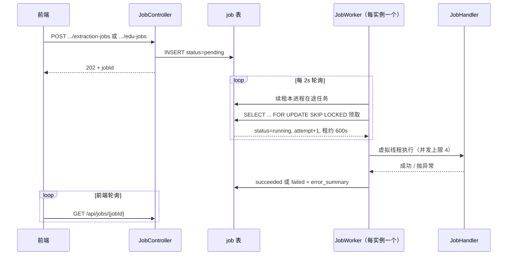

# Job 生命周期

本文描述一个后台任务（job）从提交到结束的完整流程，以及失败后的处理逻辑。代码位于 `backend/src/main/java/com/ontotrace/runcontrol/`。

## 总体架构

系统没有引入外部队列，直接用 Postgres 的 `job` 表当队列：

- 提交方（HTTP 接口）只写一行 `pending` 记录，立即返回 202。
- 每个后端实例内置一个 `JobWorker`，定时轮询 `job` 表领取到期任务，交给虚拟线程并发执行。
- 多实例部署时靠 `FOR UPDATE SKIP LOCKED` 和租约（lease）协调，同一任务不会被两个实例同时执行。



## 状态机

`job.status` 的取值和流转（见 `V003__document_version_and_jobs.sql` 的 CHECK 约束）：

```
pending ──claim──> running ──handler 成功──> succeeded
                      │
                      └──handler 抛异常──> failed（终态）

running（进程崩溃，租约过期）──被其它 worker 收回──> running（重新执行）
```

- 实际使用 `pending` / `running` / `succeeded` / `failed` 四个状态。
- CHECK 里还有 `partial` 和 `cancelled`，当前代码没有用到，也没有取消任务的接口。
- `failed` 和 `succeeded` 都是终态，**没有自动重新入队的机制**。

`stage` 是执行进度的细分阶段（`queued` → `generating` / `parsed` → `done`），配合 `progress` / `total` 给前端展示进度，不影响调度。

## 一、提交

两个入口，都在 `JobController`：

| 接口 | 类型 | 说明 |
| --- | --- | --- |
| `POST /api/documents/{documentId}/extraction-jobs` | `extract_content` | 解析 TXT/Markdown，生成不可变版本和文本单元 |
| `POST /api/document-versions/{versionId}/edu-jobs` | `extract_edu` | 对版本全文或单个文本单元（body 传 `textUnitId`）抽取 EDU |

提交阶段做的事（`JobService.submitExtract` / `submitEdu`）：

1. 权限校验：当前用户必须对文档有编辑权限（`documents.requireEdit`）。
2. 参数校验：版本存在、文本单元属于该版本。
3. 幂等：按 `idempotency_key` 查重，命中则直接返回已有任务，不新建。

幂等键的规则值得注意：

- 前端每次提交都生成新的 `Idempotency-Key`（`crypto.randomUUID()`），所以**用户重复点按钮会创建新任务**，这是有意的——EDU 支持覆盖重抽。
- 调用方不传 key 时，`extract_content` 默认 `extract_content:{documentId}`，同一文档重复提交返回同一个任务；`extract_edu` 的默认 key 含随机 UUID，每次都是新任务。

新任务初始值：`status=pending`、`stage=queued`、`attemptCount=0`、`nextRunAt=now`。接口返回 202 和任务体，前端拿 `jobId` 轮询 `GET /api/jobs/{jobId}` 直到终态。

## 二、领取

每个实例启动时创建一个 `JobWorker`，`workerId` 是进程内随机 UUID。调度循环每 `WORKER_POLL_INTERVAL`（默认 2 秒）执行一次 `poll()`：

1. **续租**：为本进程在途任务延长租约（见下文）。
2. **派发**：`dispatchAvailable()` 在信号量许可范围内循环领取任务。

领取在 `JobService.claim()` 的短事务里完成，核心 SQL 是 `JobRepository.lockNext()`：

```sql
WHERE next_run_at <= :now
  AND (status = 'pending'
       OR (status = 'running' AND lease_until < :now
           AND (worker_id IS NULL OR worker_id <> :workerId)))
ORDER BY next_run_at
LIMIT 1
FOR UPDATE SKIP LOCKED
```

领取成功后写入：`status=running`、`attemptCount+1`、`leaseUntil=now+600s`、`workerId`。

几个设计点：

- **短事务领取、事务外执行**：claim 只改状态，handler 在独立线程执行，避免长任务占着行锁和数据库连接（handler 内部自己开事务）。
- **并发上限**：`WORKER_MAX_CONCURRENCY`（默认 4）用信号量控制本进程同时执行的任务数；任务在虚拟线程上跑，模型调用这种 IO 密集场景线程开销可忽略。
- **即时补槽**：任务结束后在回调里直接调 `dispatchAvailable()`，不用等下一次轮询。
- **`inFlight` 集合**：防止同一任务被本进程重复投递。

## 三、执行

`JobService.execute()` 按任务类型路由到 `JobHandler` 实现（Spring 注入后按 `type()` 收集成 Map）。类型不存在直接判失败。

### extract_content（`ExtractContentJobHandler`）

1. 从 S3 下载资产，用 `TextDocumentParser` 解析。
2. 创建新的 `DocumentVersion`（版本号递增，不可变）。
3. 按空行切段生成 `TextUnit`，写库。
4. 回写任务的 `documentVersionId`、`progress`/`total`、`stage=parsed`。

整个过程在一个事务里。中途失败则回滚，不会留下半个版本。

### extract_edu（`ExtractEduJobHandler`）

1. **先删后写**：删掉范围内已有 EDU 及其来源、论元（全文范围删整个版本，单单元重抽只删该单元的）。这保证了重跑的幂等。
2. 逐个文本单元：组装上下文 → 模型生成 → 校验和来源定位 → 模型复核 → 写入 `Edu` / `EduSourceRef` / `EduArgument`（复核全过且定位精确才算 `active`，否则 `proposed`）。
3. 每处理完一个单元回写一次 `progress`。

注意：handler 的 `@Transactional` 包住整个执行过程，但模型调用也在这个事务里，所以长任务会长期占用一个数据库连接。这是 README 提到「并发数要明显小于连接池」的原因。

### 结果落库

- 成功：`status=succeeded`、`stage=done`。
- 异常：`status=failed`，`errorSummary` 写可读摘要。`errorSummary()` 会沿异常链找 `InterruptedIOException`，命中则写「模型请求超时。请增大 AI_CHAT_TIMEOUT」，否则用异常消息。

## 四、租约与续租

租约解决两个问题：长任务不被别的实例误判死亡，以及死掉的进程手上的任务能被接管。

- 领取时 `leaseUntil = now + JOB_LEASE_DURATION`（默认 600 秒）。
- 每次 `poll()`（2 秒一次）为本进程所有在途任务续租，条件是 `status='running' AND worker_id=本进程`。
- `lockNext` 的查询条件里，`running` 任务只有在租约过期**且不属于领取者自己**时才能被收回。

参数约束：**租约时长必须大于一次模型调用的最长耗时**。默认配置是模型超时 5 分钟（`AI_CHAT_TIMEOUT`）、租约 10 分钟。如果租约更短，任务会在模型返回前被其它 worker 抢走，造成同一任务双份执行。

优雅停机（`@PreDestroy`）只调用 `executor.shutdown()` 不等待任务完成，进程退出时在途任务停留在 `running`，靠租约过期后由其它实例（或重启后的自己，因为重启会生成新的 `workerId`）收回。

## 五、失败与重试

失败分两种情况，处理方式完全不同：

### 1. 业务失败：终态，无自动重试

handler 抛出任何异常（模型超时、校验不过、S3 拉不到文件等），`execute()` 捕获后调用 `fail()`：写 `status=failed` 和 `error_summary`，**任务就此结束，不会再入队**。

- `attempt_count` 只是领取计数，没有重试上限判断，也没有基于它的退避重试逻辑。
- 想重跑只能**重新提交**：前端再点一次按钮，带新的幂等键，创建一个新任务。
- 重新提交之所以安全，是因为 handler 设计成幂等的：`extract_edu` 先删后写；`extract_content` 的写入都在事务里，失败即回滚，重跑从干净状态开始。`JobHandler` 接口的约定就是「必须能识别已完成步骤，避免重试重复写」。

### 2. 进程死亡：租约过期后自动收回重跑

如果实例崩溃或被杀，任务来不及落 `failed`，会停留在 `running`。租约到期后（最长 `lease_seconds` + 一个轮询周期），任何 worker 都能通过 `lockNext` 收回它：`attemptCount+1`，从头重新执行。

这是系统里唯一的自动重试路径，要点：

- 回收**不检查重试上限**，也不检查上次失败原因。如果任务本身会导致进程反复崩溃，理论上会被无限收回。正常运行时不会发生，因为业务异常都走 `fail()` 落库了。
- 存活的 worker 不会抢走自己的任务：一方面 `lockNext` 排除了本 `workerId` 的行，另一方面它每 2 秒续租，租约不会过期。
- 重跑的幂等性由 handler 保证（同上）。对 `extract_edu` 来说，崩溃前已写入的 EDU 会被「先删后写」清掉重来，结果一致。

### 失败路径小结

| 场景 | status | 后续 |
| --- | --- | --- |
| handler 抛异常 | `failed` + `error_summary` | 终态，需手动重新提交 |
| 未知任务类型 | `failed` | 终态 |
| 进程崩溃/被杀 | 停留在 `running` | 租约过期后被其它 worker 收回重跑，`attempt_count+1` |
| 模型请求超时 | `failed`，摘要有配置提示 | 调大 `AI_CHAT_TIMEOUT` 后重新提交 |

## 配置参数

| 环境变量 | 默认值 | 说明 |
| --- | --- | --- |
| `WORKER_ENABLED` | `true` | 是否启用本实例的任务执行 |
| `WORKER_POLL_INTERVAL` | `2000` ms | 轮询间隔，也是续租间隔 |
| `WORKER_MAX_CONCURRENCY` | `4` | 本进程并发执行上限，应明显小于数据库连接池 |
| `JOB_LEASE_DURATION` | `600` s | 租约时长，必须大于一次模型调用耗时 |
| `AI_CHAT_TIMEOUT` | `5m` | 模型调用超时，必须小于租约时长 |

## 涉及的代码

| 文件 | 职责 |
| --- | --- |
| `runcontrol/JobController.java` | 提交和查询任务的 HTTP 接口 |
| `runcontrol/JobService.java` | 创建、领取、执行、续租、成功/失败落库 |
| `runcontrol/JobWorker.java` | 轮询调度、并发控制、虚拟线程执行 |
| `runcontrol/JobRepository.java` | `lockNext`（SKIP LOCKED 领取）、续租 SQL |
| `runcontrol/JobHandler.java` | 处理器接口约定（幂等） |
| `runcontrol/ExtractContentJobHandler.java` | 内容提取 |
| `runcontrol/ExtractEduJobHandler.java` | EDU 抽取 |
| `db/migration/V003__document_version_and_jobs.sql` | `job` 表结构 |
